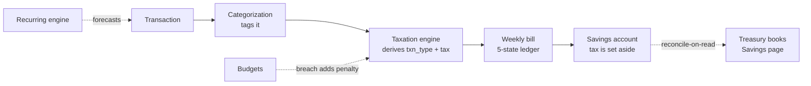
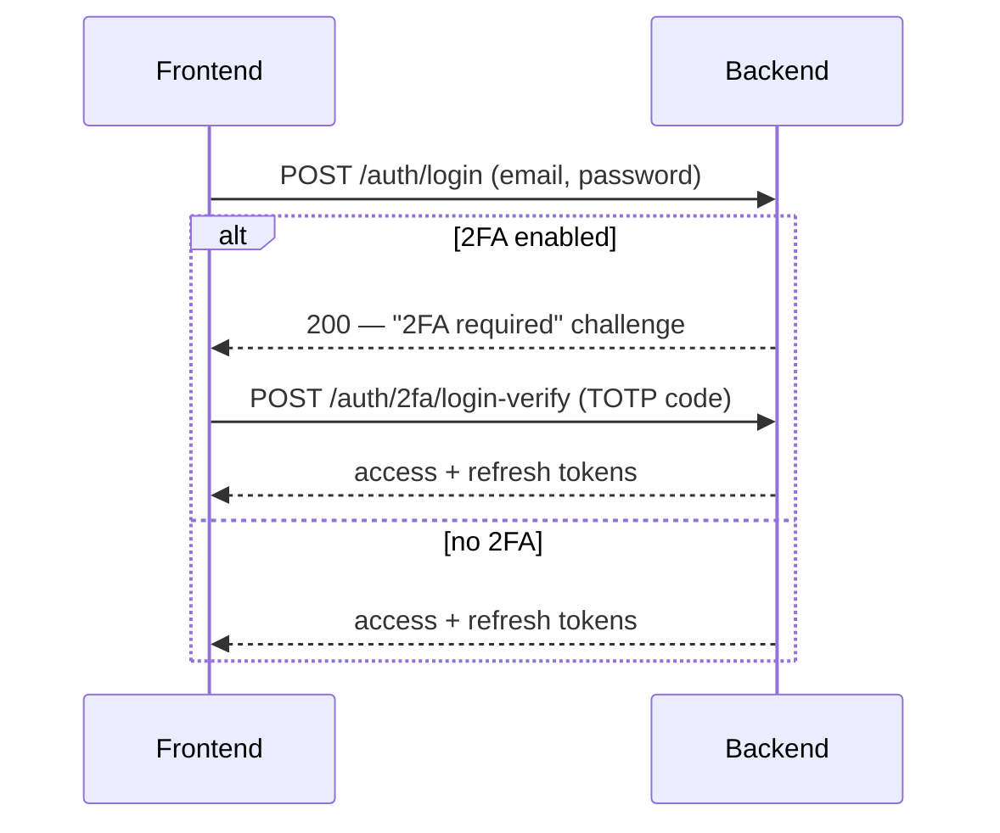
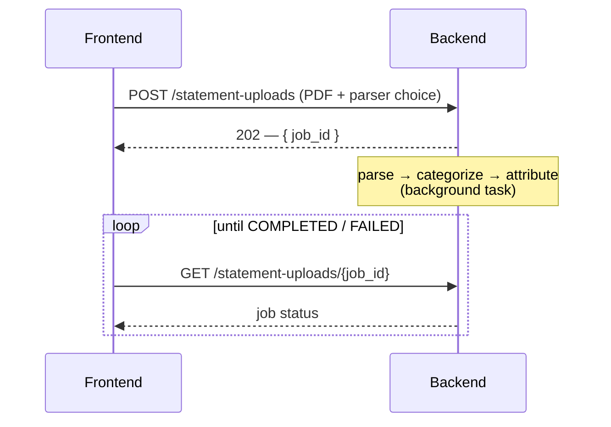

# Architecture

A developer's map of how Aevum fits together. This page covers the
**cross-cutting** picture — the two apps, the datastores, and how they talk.
Each submodule then owns the deep detail of its own internals; follow the links
at the bottom.

> User looking for how to _use_ Aevum? You want the [User Guide](USER_GUIDE/README.md),
> not this page.

## The repository

Aevum is a **monorepo of git submodules** — each submodule is its own
repository with its own history, CI, and docs:

| Path                     | What it is                                                                                   | Stack                                                                    |
| ------------------------ | -------------------------------------------------------------------------------------------- | ------------------------------------------------------------------------ |
| [`backend/`](backend/)   | The API and all domain logic                                                                 | Python · FastAPI · SQLAlchemy 2.0 (async) · PostgreSQL · Redis · Alembic |
| [`frontend/`](frontend/) | The single-page web app                                                                      | React 18 · TypeScript · Vite · Zustand · TanStack Query                  |
| `dummy-statement/`       | A dev-only tool that generates synthetic bank/UPI statements for testing the import pipeline | (standalone, own venv)                                                   |

The outer repo only tracks **which commit** of each submodule is current; all
real code lives inside the submodules. See [CONTRIBUTING.md](CONTRIBUTING.md)
for clone + setup.

## System topology

_The browser loads the static frontend; the frontend calls the backend over
REST; the backend owns Postgres (system of record), uses Redis for coordination
(distributed locks, caches, rate limits), and sends email through Brevo's HTTPS
API (the deploy host blocks outbound SMTP)._

## How the two apps talk

- **One versioned REST surface.** Every endpoint is mounted under `/api/v1/*`.
  The frontend builds every URL from a central route registry — no inline API
  strings — and the `V = '/api/v1'` constant is the single flip point for a
  version cutover.
- **Bearer-token auth.** The frontend stores access + refresh JWTs and sends
  `Authorization: Bearer …` on every request; the backend validates the session
  row behind it. (The backend also accepts a cookie, but the SPA uses Bearer.)
- **Typed contract.** The backend serves an authoritative OpenAPI schema at
  `/docs` (Swagger) and `/redoc`; the frontend regenerates its API types from it
  (`npm run gen:api`), so a contract change shows up as a type error rather than
  a runtime surprise.

## Backend shape (feature-based)

The backend uses a **screaming / feature-based** architecture: every domain
feature owns its own models, schemas, services, and routes under
`app/modules/<feature>/`, and cross-cutting infrastructure (config, the async DB
engine, security, middleware) lives in `app/core/`. Features never import each
other's internals — cross-module references go through string-based ORM
relationships and public service contracts, so there are no circular imports.

The domain itself — transactions → categorization → taxation → bills → savings
account → treasury — is described in the [README](README.md#how-it-works) (for
the idea) and in the backend docs (for the mechanics). The **treasury** module is
the accounting view over the set-aside cash (an append-only revenue journal,
reconcile-on-read); it's a one-way reader of taxation + transactions and backs
the frontend's **"Savings"** page.

→ Full detail: [`backend/docs/architecture.md`](backend/docs/architecture.md),
the per-module pages under [`backend/docs/modules/`](backend/docs/modules/), and
the data model in [`backend/docs/database.md`](backend/docs/database.md).

## Frontend shape (feature-isolated)

The frontend mirrors the backend's feature split: code lives under
`src/features/<feature>/`, shared primitives under `src/shared/`, and the app
shell under `src/app/`. Feature isolation is **enforced by the toolchain** —
`eslint-plugin-boundaries` forbids a feature from importing another feature's
internals; a feature reaches another only through its public `api/` surface, and
the handful of deliberate cross-feature compositions carry an explicit
allow-rule. Routing is a data router with per-feature lazy-loaded route arrays.

→ Full detail: [`frontend/docs/architecture.md`](frontend/docs/architecture.md),
the conventions in [`frontend/docs/conventions.md`](frontend/docs/conventions.md),
and the per-module pages under [`frontend/docs/modules/`](frontend/docs/modules/).

## Two flows worth seeing end-to-end

**Sign-in with two-factor** — the backend can answer a login with a _challenge_
instead of a session:

**Statement import** — parsing is asynchronous; the request returns immediately
with a job id the frontend polls:

→ Auth detail: [`backend/docs/modules/auth.md`](backend/docs/modules/auth.md).
Statement-upload detail:
[`backend/docs/modules/transactions.md`](backend/docs/modules/transactions.md).

## Deployment

Both apps deploy to **Render** (the frontend as a static site, the backend as a
Docker web service alongside managed Postgres + Redis). The runbook lives in
[`backend/docs/deployment.md`](backend/docs/deployment.md).

## Where to go next

- **Run it locally / contribute** → [CONTRIBUTING.md](CONTRIBUTING.md)
- **Backend internals** → [`backend/docs/`](backend/docs/)
- **Frontend internals** → [`frontend/docs/`](frontend/docs/)
