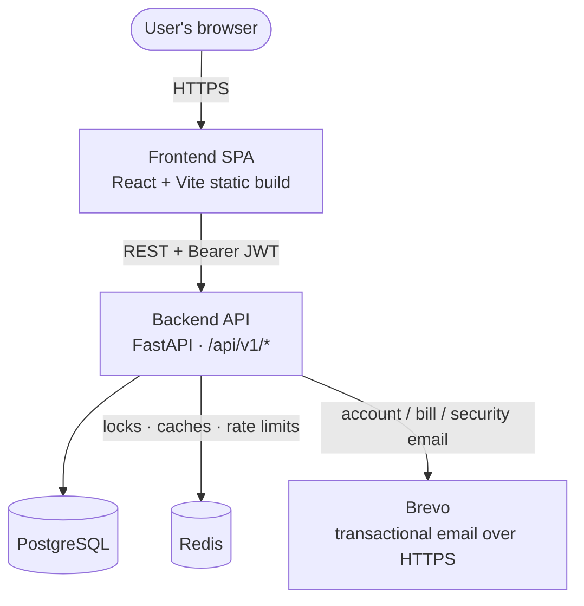
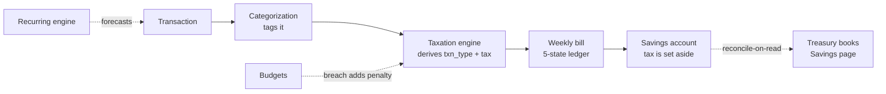
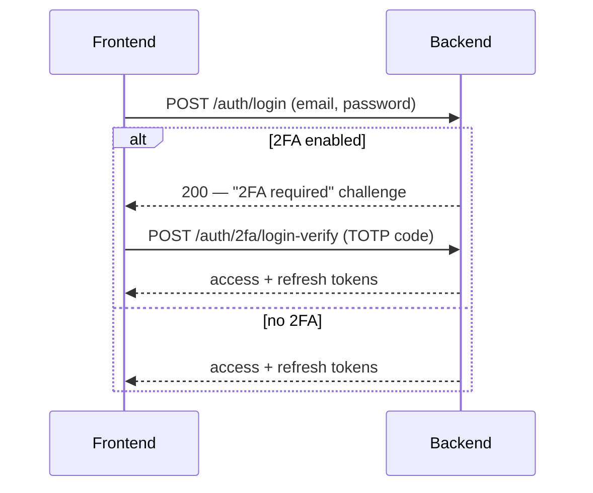
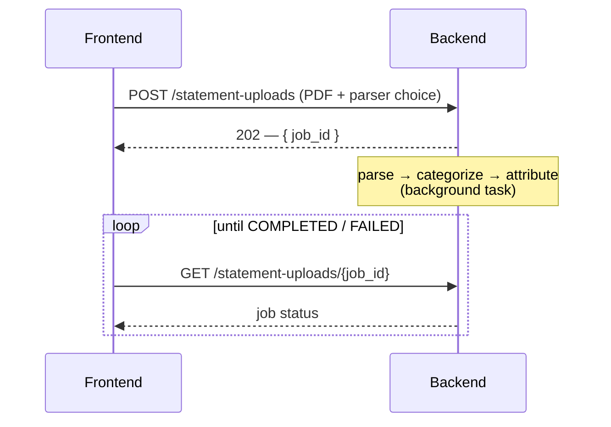

# Architecture

A developer's map of how Aevum fits together. This page covers the
**cross-cutting** picture — the two apps, the datastores, and how they talk.
Each lane then owns the deep detail of its own internals; follow the links as
you go.

> User looking for how to _use_ Aevum? You want the [User Guide](docs/public/README.md),
> not this page.

## The repository

Aevum is built as two independent repositories — each with its own history, CI,
and docs. This repo does not vendor or track them; it **aggregates** them:

| Lane         | What it is                   | Stack                                                                    |
| ------------ | ---------------------------- | ------------------------------------------------------------------------ |
| `aevum-api`  | The API and all domain logic | Python · FastAPI · SQLAlchemy 2.0 (async) · PostgreSQL · Redis · Alembic |
| `aevum-web`  | The single-page web app      | React 18 · TypeScript · Vite · Zustand · TanStack Query                  |

**Both lanes are private**, so this repo does not link into them: every page you
need is mirrored here instead. Each lane's public documentation is copied into
[`docs/internal/`](docs/internal/) (stamped with the commit it came from), and
the product docs in [`docs/public/`](docs/public/) merge the two. So this map —
and everything it points at — resolves from a plain clone, with no access to
either lane. See [CONTRIBUTING.md](CONTRIBUTING.md) for setup.

## The product, feature by feature

Every user-facing capability is documented as one product topic under
[`docs/public/`](docs/public/), merged from the backend's mechanism and the
frontend's surface:

<!-- BEGIN GENERATED:feature-index -->

| Topic | Covers |
| --- | --- |
| [Getting started](docs/public/getting-started.md) | Onboarding · Dashboard |
| [The consumption tax & your weekly bill](docs/public/consumption-tax.md) | Taxation |
| [Your savings account](docs/public/savings-account.md) | Bank accounts · Treasury |
| [Transactions](docs/public/transactions.md) | Transactions |
| [Beneficiaries](docs/public/beneficiaries.md) | Beneficiaries |
| [Categories & rules](docs/public/categories-and-rules.md) | Categorization · Tags |
| [Budgets](docs/public/budgets.md) | Budgets |
| [Paying by UPI](docs/public/paying-by-upi.md) | Payments |
| [Recurring bills](docs/public/recurring.md) | Recurring |
| [Account & security](docs/public/account-and-security.md) | Auth · Users · Account |
| [Your data & privacy](docs/public/data-and-privacy.md) | Exports |
| [Notifications & activity](docs/public/notifications.md) | Activity feed |

<!-- END GENERATED:feature-index -->

## System topology

_The browser loads the static frontend; the frontend calls the backend over
REST; the backend owns Postgres (system of record), uses Redis for coordination
(distributed locks, caches, rate limits), and sends email through Brevo's HTTPS
API (the deploy host blocks outbound SMTP)._

## How the two apps talk

- **One versioned REST surface.** Every endpoint is mounted under `/api/v1/*`.
  The frontend builds every URL from a central route registry — no inline API
  strings — and the `V = '/api/v1'` constant is the single flip point for a
  version cutover.
- **Bearer-token auth.** The frontend stores access + refresh JWTs and sends
  `Authorization: Bearer …` on every request; the backend validates the session
  row behind it. (The backend also accepts a cookie, but the SPA uses Bearer.)
- **Typed contract.** The backend serves an authoritative OpenAPI schema at
  `/docs` (Swagger) and `/redoc`; the frontend regenerates its API types from it
  (`npm run gen:api`), so a contract change shows up as a type error rather than
  a runtime surprise.

## How the code is organized

Both apps use the same **screaming / feature-based** shape: every domain feature
owns its models, schemas, services and routes (backend) or its pages, hooks and
API surface (frontend); features never reach into each other's internals — only
through a public contract. Cross-cutting infrastructure and shared primitives
live in their own layers.

<!-- BEGIN GENERATED:module-tree -->

**Backend — `app/`**

- `core/` — infrastructure: config, the async DB engine, cache, scheduler, storage, middleware, the model registry
- `shared/` — ownerless cross-feature helpers (serial ids, calendar periods, password hashing / encryption) that depend only on core
- `constants/` — system-wide constants and reference data — one import surface
- `db/` — first-run migrate + seed
- `modules/` — the features — one directory each (see below)
- `web/` — the server-rendered landing page route (outside /api/v1)
- `main.py` — entrypoint: wires every router under /api/v1

**Frontend — `src/`**

- `app/` — the shell — providers, router, the root layout every page mounts inside
- `shared/` — cross-feature primitives: the typed API client, UI components, hooks, Zustand stores
- `features/` — one folder per surface — auth, transactions, taxation, budgets, … (the product)

<!-- END GENERATED:module-tree -->

On the backend, cross-module references go through string-based ORM
relationships and public service contracts, so there are no circular imports. On
the frontend, feature isolation is **enforced by the toolchain** —
`eslint-plugin-boundaries` forbids a feature from importing another feature's
internals; a feature reaches another only through its public `api/` surface, and
the handful of deliberate cross-feature compositions carry an explicit
allow-rule. Routing is a data router with per-feature lazy-loaded route arrays.

→ Deep detail: the backend's own overview in
[`docs/internal/backend/architecture.md`](docs/internal/backend/architecture.md)
and the frontend's in
[`docs/internal/frontend/architecture.md`](docs/internal/frontend/architecture.md).

## The domain flow

The heart of Aevum: transactions → categorization → taxation → bills → savings
account → treasury. The **treasury** is the accounting view over the set-aside
cash (an append-only revenue journal, reconcile-on-read); it's a one-way reader
of taxation + transactions and backs the frontend's **"Savings"** page.

→ The idea, for a general reader: [README](README.md#how-it-works). The full
product walk-throughs: [the consumption tax](docs/public/consumption-tax.md),
[your savings account](docs/public/savings-account.md), and the rest under
[`docs/public/`](docs/public/).

## Two flows worth seeing end-to-end

**Sign-in with two-factor** — the backend can answer a login with a _challenge_
instead of a session:

**Statement import** — parsing is asynchronous; the request returns immediately
with a job id the frontend polls:

→ For users: [account & security](docs/public/account-and-security.md) and the
import section of [transactions](docs/public/transactions.md).

## How the constellation stays in sync

Four repos, and the automation between them is easy to mistake for magic. Every
mechanism is documented **in the repo that owns it** — the one whose CI runs it, or
whose config declares it. This table is the map; the owner's doc is the detail.

| What | Owner | Fires on | Reaches | Credential |
|---|---|---|---|---|
| Docs mirror + fold | `aevum-hub` | push to `main`, weekly cron | this repo | `DOCS_TOKEN` — **read** on both lanes |
| Screenshot capture | `aevum-web` | a **green CI** on its `main` | `aevum-hub@main` | `SCREENSHOT_DISPATCH_PAT` |
| Brand publish | `aevum-brand` (private) | brand assets or the map change | 4 push consumers (org) + 1 pull (personal site) | `BRAND_DISPATCH_PAT` (org) |
| Docs generation | each lane | pre-commit, then CI | its own tree | none — `GITHUB_TOKEN` |
| Deploys | each lane | push to `main` | Render | held at Render |

Two directions, and the difference is the thing to remember: **docs are PULLED**
(this repo mirrors each lane's public docs — a lane publishes by landing on `main`
and triggers nothing), while **images are PUSHED** (a lane's CI writes into this
repo, because only it knows when a view changed).

Consequences worth knowing before debugging:

- **Two producers write to this repo's `main`.** The screenshot dispatcher retries
  onto the new tip on rejection; the fold runs under a concurrency group. A lost
  race is expected, not a fault.
- **A missing token degrades differently per mechanism.** The docs fold *fails*
  loudly at checkout. The brand dispatcher *skips* the consumer with a warning and
  still goes green — so a consumer that stopped receiving updates is a log question
  before it is a map question.
- **Nothing here reaches back into a private lane.** This repo reads them; it never
  writes to them. A fix to a mirrored doc belongs in the lane that authored it.

Details live with their owners: this repo's pipeline in
[`docs/engineering/documentation.md`](docs/engineering/documentation.md), and each
lane's in its own `docs/internal/handbook/documentation.md`.

## Deployment

Both apps deploy to **Render** (the frontend as a static site, the backend as a
Docker web service alongside managed Postgres + Redis). The deployment runbook
lives in the backend lane's own internal docs.

## Where to go next

- **Run it locally / contribute** → [CONTRIBUTING.md](CONTRIBUTING.md)
- **By the numbers** (modules, tests, SLOC, latency, Lighthouse) → [METRICS.md](METRICS.md)
- **Backend docs** (mirrored) → [`docs/internal/backend/`](docs/internal/backend/)
- **Frontend docs** (mirrored) → [`docs/internal/frontend/`](docs/internal/frontend/)
- **How the docs themselves work** (the mirror, the merge, the fold) →
  [`docs/engineering/documentation.md`](docs/engineering/documentation.md)
