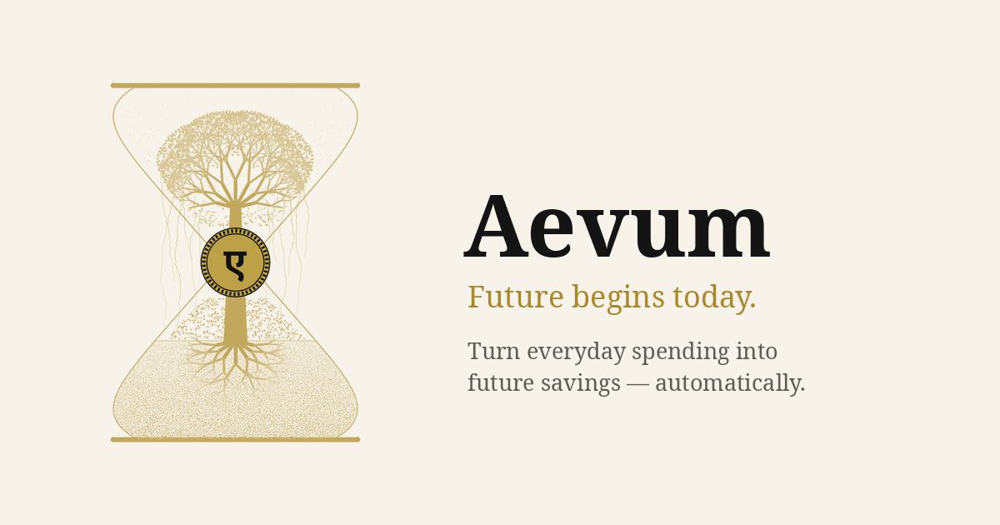
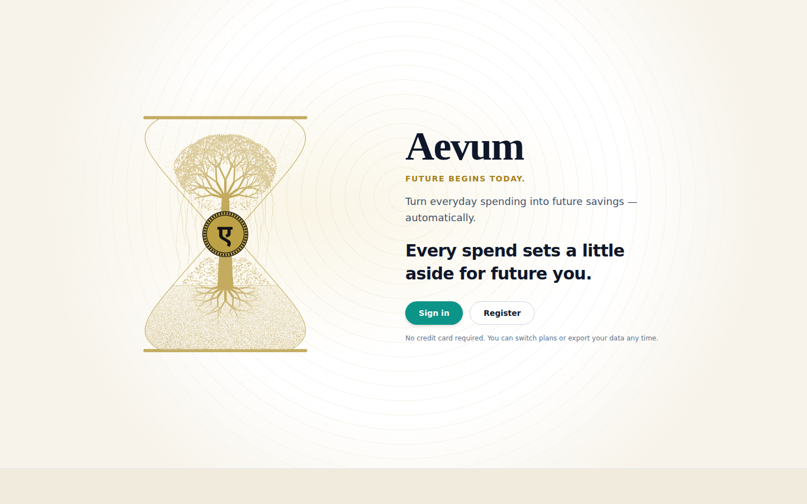
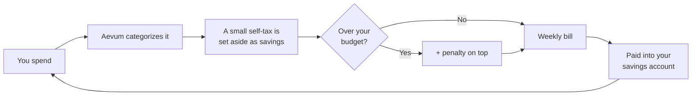
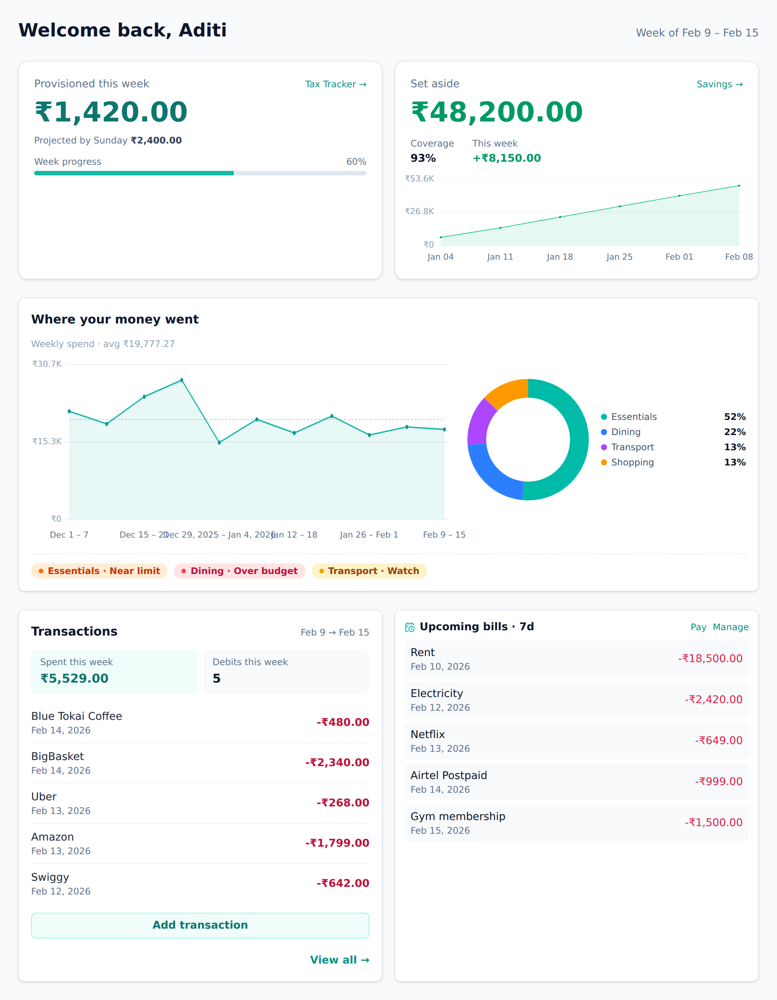

  <picture>
    <source media="(prefers-color-scheme: dark)"  srcset="docs/public/images/brand/product-banner-dark.png">
    <source media="(prefers-color-scheme: light)" srcset="docs/public/images/brand/product-banner-cream.png">
    
  </picture>

<!-- BRAND:start -->
<!-- Generated from tooling/branding.json via `npm run sync-readme`. That file is PUSHED by
     the private aevum-brand repo (the brand SoT) — edit brand copy there, never here. -->
# Aevum

> **Future begins today.**

**Aevum means an age — time that endures and accrues rather than runs out.** Wealth is meant to grow the same way: gently, one ordinary step at a time. Most money apps are built on fear — budgets, streaks, the guilt when you slip; they're very good at making you anxious and not very good at making you wealthier. Aevum starts from the opposite premise: a small nudge you set yourself turns everyday spending into savings — a quiet push in the right direction that never becomes a shove. No pressure, no shame, no discipline required — just a calmer path to real wealth that grows while you live your life.
<!-- BRAND:end -->

<picture>
  <source media="(prefers-color-scheme: dark)" srcset="docs/public/images/screenshots/landing-dark.png">
  
</picture>

---

## How it works

Most budgeting apps just tell you what you spent. Aevum turns each expense into a
small act of saving. Spend on something, and a fraction of it is set aside as a
self-imposed tax — money you're quietly provisioning for future expenses of the
same kind.

- **Discretionary** spending (dining out, shopping) is taxed a little more.
- **Essential** spending (groceries, utilities) is taxed a little less.
- **Fixed commitments** (rent, loan EMIs) and **exempted** items aren't taxed.

The tax is collected into your **savings account** every week. On top of that, you
set budgets per category — and if you overspend one, Aevum adds a _penalty_ to
that week's bill, so going over the line costs a bit more than staying within it.

_Every expense is categorized → a small self-tax is set aside as a future
provision → overspending a budget adds a penalty → it all rolls into one weekly
bill, paid from your everyday account into your savings account._

The tax is **self-imposed**: you set the budgets and the rates. The money isn't
just tracked — it's actually moved into your savings account, so the discipline
turns into a real balance. That savings account is the foundation Aevum will
build on as it grows.

<picture>
  <source media="(prefers-color-scheme: dark)" srcset="docs/public/images/screenshots/dashboard-dark.png">
  
</picture>

## What you can do

- **Track every transaction** — add them by hand or import a bank / UPI
  statement (PhonePe, Google Pay, Paytm, and more) and let Aevum read it for you.
- **Auto-categorize spending** with smart, hierarchical categories — set a rule
  once for a merchant and Aevum tags it for you from then on.
- **Turn spending into savings** — your self-imposed taxes are moved out of your
  everyday account and into a dedicated savings account, so everyday purchases
  quietly build a real provision for the future.
- **Set budgets that matter** — per category, per period. Spend within them and
  you pay only the base tax; go over and a penalty is added on top.
- **Get one weekly bill** — Aevum totals your consumption tax (plus any
  penalties) for the week into a single, concrete number you settle.
- **See recurring bills coming** — Aevum learns your repeating expenses from
  history and forecasts them, so nothing surprises you.
- **Keep your account secure** — two-factor authentication, device-aware
  sign-in, and account recovery are built in.
- **Stay in the loop** — a notifications feed surfaces new bills, budget
  breaches, failed imports, and anything else worth your attention.

## Learn more

New here? Start with the [**User Guide**](docs/public/README.md). Useful entry
points:

- [Getting started](docs/public/getting-started.md) — create an account and add
  your first transaction
- [The consumption tax & your weekly bill](docs/public/consumption-tax.md) — the
  idea at the heart of Aevum
- [Your savings account](docs/public/savings-account.md) — where the tax goes, and
  what's coming next
- [Transactions & importing](docs/public/transactions.md) ·
  [Budgets](docs/public/budgets.md) · [Categories & rules](docs/public/categories-and-rules.md)
  · [Recurring bills](docs/public/recurring.md)
- [Account & security](docs/public/account-and-security.md) ·
  [Your data & privacy](docs/public/data-and-privacy.md)

---

### Building Aevum?

Aevum is built as two repositories — a **FastAPI** backend and a **React**
frontend. This repo is Aevum's public home: it carries the product docs and
mirrors each lane's documentation. If you want to understand how it's put
together, or run it locally:

- [**CONTRIBUTING.md**](CONTRIBUTING.md) — tech stack, setup, running both apps,
  testing, and configuration
- [**ARCHITECTURE.md**](ARCHITECTURE.md) — how the pieces fit together, then a
  route down into each lane's mirrored docs under [`docs/`](docs/)

> "Aevum" is the product brand; "Personal Budget App" is the legacy name still
> used as this monorepo's directory name.
