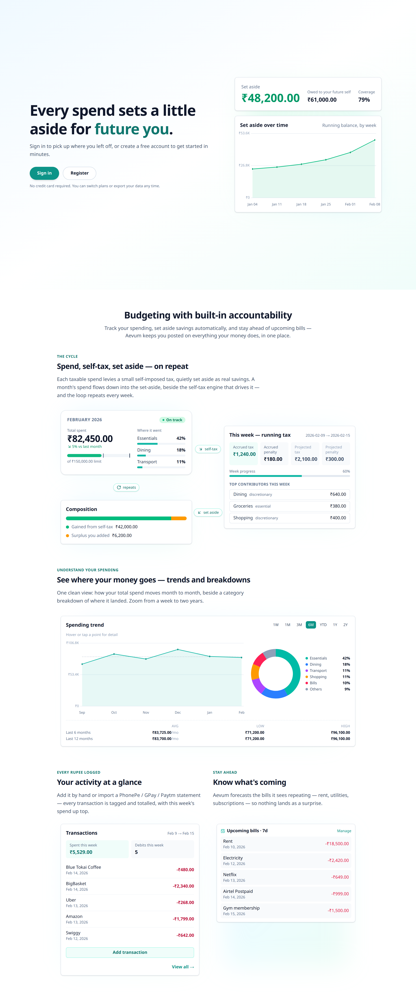
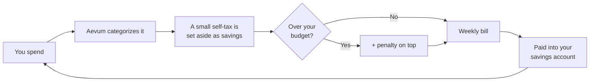
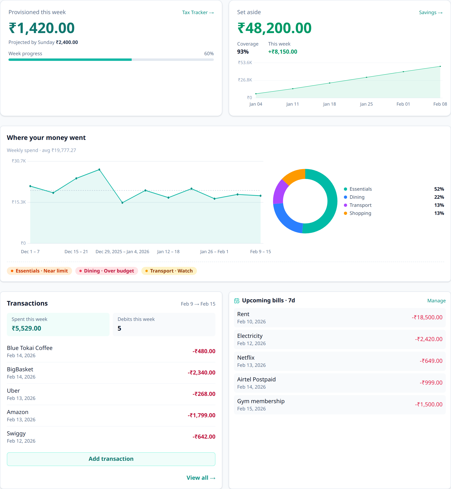

<!-- BRAND:start -->
<!-- Generated from backend/app/constants/branding.json — `npm run sync-readme` in tooling. -->
# Aevum

> **Future begins today.**

**Aevum is a personal-finance app that turns everyday spending into future savings — automatically.** Every time you incur an expense, Aevum levies a small self-imposed "consumption tax" and transfers the proceeds into a dedicated savings account of your choice, building a provision for that same kind of expense down the road. Set budgets for the things that matter, and overspending adds a penalty on top — a sharper nudge to stay disciplined. It also auto-categorizes your transactions, generates smart expense analytics, and forecasts recurring bills, while the weekly tax ledger increments your savings pool. It's a budgeting tool with built-in self-accountability — a savings habit that quietly funds your future self.
<!-- BRAND:end -->

---

## How it works

Most budgeting apps just tell you what you spent. Aevum turns each expense into a
small act of saving. Spend on something, and a fraction of it is set aside as a
self-imposed tax — money you're quietly provisioning for future expenses of the
same kind.

- **Discretionary** spending (dining out, shopping) is taxed a little more.
- **Essential** spending (groceries, utilities) is taxed a little less.
- **Fixed commitments** (rent, loan EMIs) and **exempted** items aren't taxed.

The tax is collected into your **savings account** every week. On top of that, you
set budgets per category — and if you overspend one, Aevum adds a _penalty_ to
that week's bill, so going over the line costs a bit more than staying within it.

_Every expense is categorized → a small self-tax is set aside as a future
provision → overspending a budget adds a penalty → it all rolls into one weekly
bill, paid from your everyday account into your savings account._

The tax is **self-imposed**: you set the budgets and the rates. The money isn't
just tracked — it's actually moved into your savings account, so the discipline
turns into a real balance. That savings account is the foundation Aevum will
build on as it grows.

## What you can do

- **Track every transaction** — add them by hand or import a bank / UPI
  statement (PhonePe, Google Pay, Paytm, and more) and let Aevum read it for you.
- **Auto-categorize spending** with smart, hierarchical categories — set a rule
  once for a merchant and Aevum tags it for you from then on.
- **Turn spending into savings** — your self-imposed taxes are moved out of your
  everyday account and into a dedicated savings account, so everyday purchases
  quietly build a real provision for the future.
- **Set budgets that matter** — per category, per period. Spend within them and
  you pay only the base tax; go over and a penalty is added on top.
- **Get one weekly bill** — Aevum totals your consumption tax (plus any
  penalties) for the week into a single, concrete number you settle.
- **See recurring bills coming** — Aevum learns your repeating expenses from
  history and forecasts them, so nothing surprises you.
- **Keep your account secure** — two-factor authentication, device-aware
  sign-in, and account recovery are built in.
- **Stay in the loop** — a notifications feed surfaces new bills, budget
  breaches, failed imports, and anything else worth your attention.

## Learn more

New here? Start with the [**User Guide**](USER_GUIDE/README.md). Useful entry
points:

- [Getting started](USER_GUIDE/getting-started.md) — create an account and add
  your first transaction
- [The consumption tax & your weekly bill](USER_GUIDE/consumption-tax.md) — the
  idea at the heart of Aevum
- [Your savings account](USER_GUIDE/savings-account.md) — where the tax goes, and
  what's coming next
- [Budgets](USER_GUIDE/budgets.md) · [Categories & rules](USER_GUIDE/categories-and-rules.md)
  · [Recurring bills](USER_GUIDE/recurring.md)
- [Importing statements](USER_GUIDE/importing-statements.md) ·
  [Account & security](USER_GUIDE/account-and-security.md) ·
  [Your data & privacy](USER_GUIDE/your-data-and-privacy.md)

---

### Building Aevum?

Aevum is a monorepo of two git submodules — a **FastAPI** backend and a
**React** frontend. If you want to run it locally, contribute, or understand how
it's put together:

- [**CONTRIBUTING.md**](CONTRIBUTING.md) — tech stack, setup, running both apps,
  testing, and configuration
- [**ARCHITECTURE.md**](ARCHITECTURE.md) — how the pieces fit together, then a
  route down into each submodule's own docs

> "Aevum" is the product brand; "Personal Budget App" is the legacy name still
> used as this monorepo's directory name.
