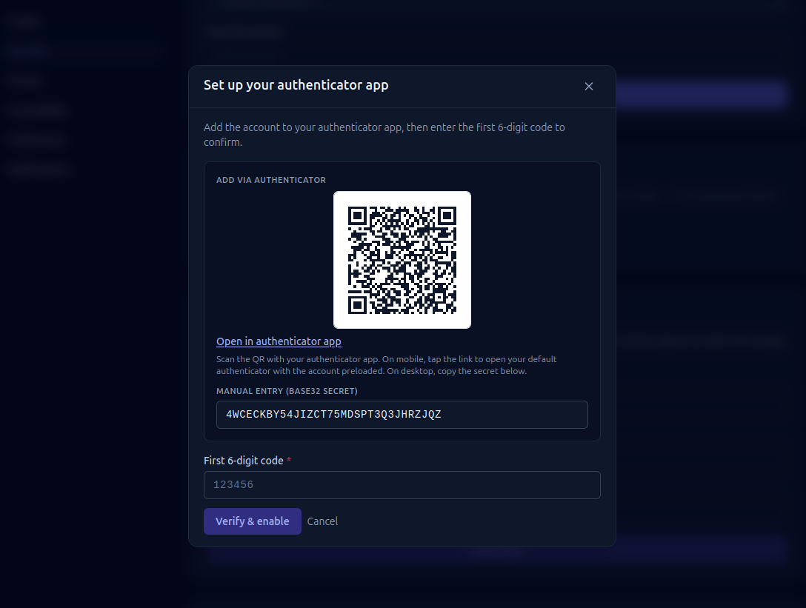

# Account & security

Aevum holds your financial picture, so it takes account security seriously.
Here's what's available and how to use it.

## How Aevum protects your account

Some protections are always on — no setup required:

- **Your password is never stored.** It's hashed with bcrypt (a strong, salted,
  one-way algorithm), so Aevum can't read it and it's never returned in any
  response.
- **Brute-force attempts are blocked.** Repeated wrong-password attempts
  temporarily lock the account, and sign-in and recovery requests are
  rate-limited.
- **Your second factor is protected at rest.** If you enable 2FA, the secret is
  stored encrypted, and your backup codes are hashed and single-use.
- **A disabled account can't be muscled open.** The controls that lock an
  account are designed so they can't simply be bypassed through recovery.

The features below — 2FA, device verification, session control — are the ones
*you* switch on, on top of those defaults.

## Two-factor authentication (2FA)

Turn on 2FA to require a one-time code from an authenticator app (Google
Authenticator, Authy, etc.) in addition to your password. To set it up, go to
your account security settings, scan the QR code with your app, and confirm a
code to finish enrolling.

<!-- TODO: screenshot — the 2FA enrollment screen (QR + confirm) -->

When 2FA is on, signing in asks for your code after your password. It also
protects sensitive actions like changing your email.

### Backup codes

Enrolling gives you a set of **backup codes**. Keep them somewhere safe — each
one gets you in once if you ever lose access to your authenticator. They're
single-use.

## New-device verification

When you sign in from a device Aevum hasn't seen before, it emails you a
verification code to confirm it's really you. Verified devices are remembered, so
you're not prompted every time on your own machines.

## Managing your sessions

You can see where you're signed in and sign out individual sessions — handy if
you've used a shared or public computer. There's also a one-click link in your
new-device email to revoke a device you don't recognize.

## Changing your email or password

- **Password** — changing it signs out your *other* sessions (you stay signed in
  where you are) and emails you a heads-up.
- **Email** — because your email is your sign-in identity, changing it requires
  confirming a code sent to the new address (and your 2FA code if enabled). Your
  old address is notified too.

## If you're locked out

Use **account recovery** to regain access via a code sent to your email. Recovery
is rate-limited and, when 2FA is enabled, still respects it — so recovery can't
be used to slip past your second factor.

## Deleting your account

You can delete your account from settings. Deletion has a **grace period**: your
account is deactivated immediately but not erased right away, so you can change
your mind and **cancel the deletion** within the window. After that, it's
permanently removed.

## Notifications

A notifications feed (the bell in the top bar) keeps you informed — a new weekly
bill, a budget breach, a failed import, or a security setup that needs finishing.
You choose which kinds of notifications you want in **Account → Notifications**.

## FAQ

**Do I need 2FA?**
It's optional but strongly recommended — it's the single biggest improvement to
your account's safety.

**I lost my authenticator and my backup codes.**
Use account recovery via your email to regain access, then re-enroll 2FA.

**Will I get prompted on every sign-in from my own laptop?**
No — once a device is verified it's remembered. New or unrecognized devices get
the extra check.

**I deleted my account by mistake.**
As long as you're within the grace period, open the cancel-deletion link and your
account is restored.
