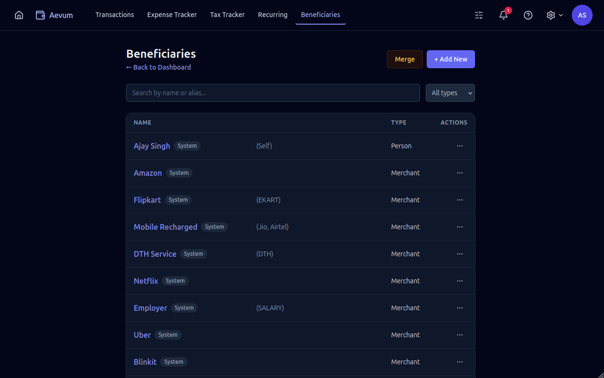

# Beneficiaries

A **beneficiary** is the other side of a transaction — the shop you paid or the
person you sent money to. Beneficiaries are how Aevum understands _who_ your
money goes to, which is what powers automatic categorization and your
spending-by-payee insights.

## Two kinds: merchants and people

- **Merchants** are businesses — a coffee shop, your electricity provider, an
  online store.
- **People** are individuals — a friend you split a bill with, family, a
  landlord.

The distinction helps Aevum reason about your spending and keeps merchant
analytics separate from personal transfers.

## Aliases

The same payee often shows up under slightly different names — especially in
imported statements ("STARBUCKS", "Starbucks India", "STARBUCKS #4471"). You can
give a beneficiary **aliases** so all those variations map to one payee, and
Aevum keeps your history tidy instead of scattering it across near-duplicates.
When you import a statement, matching against aliases is part of how transactions
get attributed to the right beneficiary.

## Merging duplicates

If two beneficiaries turn out to be the same payee, **merge** them. Merging folds
one into the other — combining their transaction history and aliases — so your
reports and categorization stay accurate. It's the cleanup tool for when
duplicates slip in over time.

## How beneficiaries connect to the rest of Aevum

- **Categorization** — a [rule](categories-and-rules.md) maps a beneficiary to
  categories, so every transaction with that payee is tagged automatically.
- **Transactions** — you pick a beneficiary when [adding a
  transaction](transactions.md); if it has a rule, your categories fill in for
  you.
- **System beneficiaries** — Aevum seeds a few (they carry a "System" chip). You
  can edit them; the chip just notes where they came from.

## FAQ

**Do I have to create beneficiaries up front?**
No — you can add one on the spot while entering a transaction, and imports create
them for you.

**What's the difference between a beneficiary and a category?**
A beneficiary is _who_ the money involved; a category is _what kind_ of spending
it was. A rule connects the two ("this payee → these categories").

**I have the same shop listed twice.**
Merge them — your history and aliases combine into a single payee.
