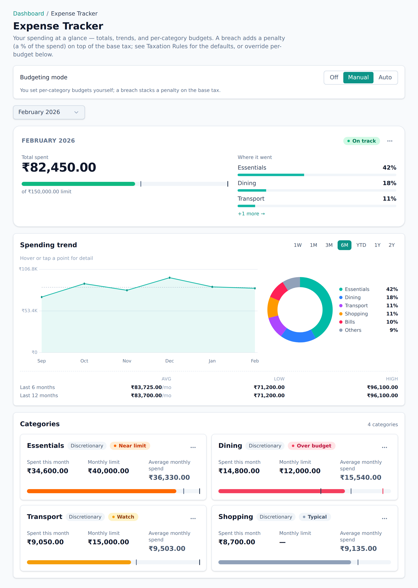

# Budgets

A budget is a limit you set for a category over a period — say, ₹8,000 on Dining
each month. Budgets are how you tell Aevum what "too much" means for _you_.

Budgets live on the **Expense Tracker** — a single month-scoped page (its nav
label is "Expense Tracker") that brings three things together: what you've spent
in each category, the limit you've set for it, and how you're tracking against
that limit. You set, adjust, and watch your budgets all in one place.

<picture>
  <source media="(prefers-color-scheme: dark)" srcset="images/screenshots/expense-tracker-dark.png">
  
</picture>

## Setting a budget

On the **Expense Tracker**, pick a category, set the amount and the period, and
save. You can have as many budgets as you like, across different categories.

## What happens when you go over

Staying within a budget costs you only the normal
[consumption tax](consumption-tax.md). **Going over adds a penalty** on top of
the base tax — but only for the spending that actually crosses the line:

- Spend up to your limit → base tax only.
- The transaction that tips you over the limit, and everything after it that
  period → base tax **plus** a penalty.

A refund or credit that brings you back under the limit eases off the penalty
again. In other words, the penalty tracks where you _actually_ stand against the
budget, moment to moment.

You can set the penalty rates yourself on the Taxation Rules page (defaults are
around 20% for essential categories and 50% for discretionary ones).

## Keeping an eye on budgets

The Expense Tracker shows each category's spending against its limit for the
month (with an over-budget marker when you've crossed one), and your dashboard
carries a summary. Aevum also sends you a notification when you breach a budget —
so a penalty is never a surprise.

## FAQ

**Is a budget required?**
No. Without a budget, spending in that category is simply taxed at the base rate.
Budgets are opt-in limits that add the penalty layer on top.

**Does the penalty apply to the whole month's spending?**
No — only from the point you cross the limit onward, not retroactively to
everything you spent that period.

**Can different categories have different limits and penalties?**
Yes. Budgets are per category and per period, and penalty rates are set per
spending type.
