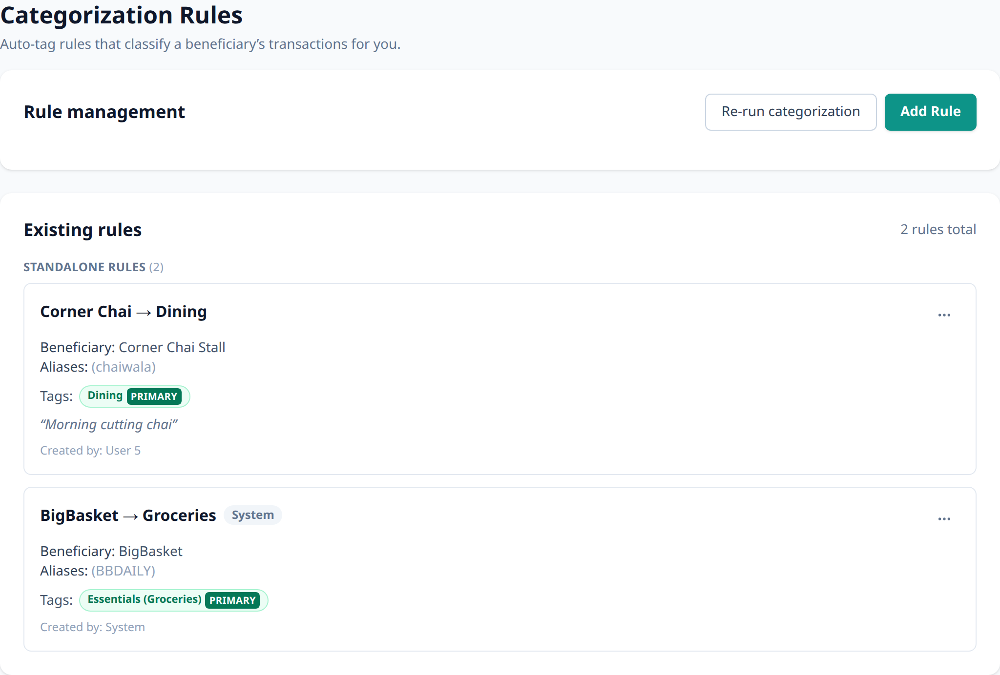

# Categories & rules

Categories (Aevum calls them **tags**) are how your spending gets sorted — and
sorting is what drives your tax, budgets, and reports. This page explains how
they work and how to put them on autopilot.

## Categories are a tree

Tags are **hierarchical**: broad categories contain narrower ones (for example,
_Food_ might contain _Groceries_ and _Dining_). When you tag a transaction with
a child, its parents apply too — so a Dining expense also counts toward Food
automatically.

Every tag also has a **type** that decides how it's taxed — discretionary,
essential, a fixed commitment, or exempted. See
[the consumption tax](consumption-tax.md) for what each type means.

## System categories

Aevum ships with a starter set of categories so you're productive immediately.
These carry a small **"System"** chip to show Aevum created them. You can still
rename them, re-tag them, or adjust them — the chip stays as a note about where
the category came from, not a lock. (A few core system categories are protected
from deletion because the app relies on them.)

## Rules put categorization on autopilot

A **rule** links a beneficiary to one or more categories: _"anything from Coffee
Shop → Dining."_ Set a rule once and Aevum tags every future transaction with
that beneficiary for you.

You create and manage rules on the **Categorization Rules** page (in Settings).
There's at most one rule per beneficiary, and like categories, the ones Aevum
seeded wear a "System" chip.

### Creating a rule while adding a transaction

You don't have to go to the rules page first. While
[adding a transaction](transactions.md):

- Picking a beneficiary that already has a rule **auto-fills** its categories.
- If you change those categories, Aevum shows you exactly what's different and
  asks whether to use the change **just this once** or **update the rule**.
- If you choose to create or update a rule, Aevum saves your transaction and
  takes you to the rules page with everything pre-filled, so you finish in the
  place that owns rules.

## FAQ

**What's the difference between a category and a rule?**
A category is a label (with a tax type). A rule is an automatic instruction:
"give this beneficiary these categories." Categories describe; rules automate.

**Why does editing a "System" category keep the chip?**
The chip records that Aevum originally created the category — editing it doesn't
change that history, so the chip stays. It never stops you from editing.

**What if a transaction has no matching rule?**
It's left in a general "uncategorized" state (and taxed at the standard rate)
until you categorize it or add a rule.
