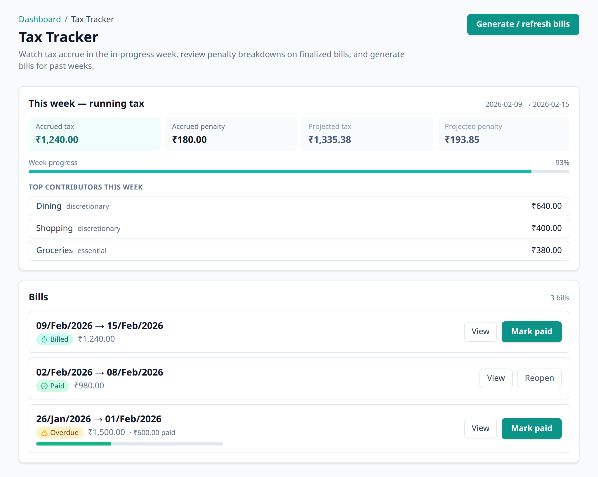

# The consumption tax & your weekly bill

This is the idea at the heart of Aevum. It's worth five minutes.

## Why a "tax" on your own spending?

Most budgeting apps just _tell you_ what you spent. Aevum turns each expense into
a small act of saving. Every time you spend, a fraction of it is set aside as a
**self-imposed consumption tax** — money you're quietly provisioning for future
expenses of the same kind. The tax isn't a punishment; it's a forced savings
habit attached to the act of spending.

The money is real: it's collected into your
[savings account](savings-account.md), not just tallied on a screen.

## How much is taxed

Every expense is sorted into a **type**, and each type has its own tax rate. The
defaults are:

| Type of spending      | Examples                            | Default tax    |
| --------------------- | ----------------------------------- | -------------- |
| **Discretionary**     | dining out, shopping, entertainment | ~10%           |
| **Essential**         | groceries, utilities, transport     | ~5%            |
| **Fixed commitments** | rent, loan EMIs                     | 0% (not taxed) |
| **Exempted**          | things you choose to exclude        | not taxed      |

Discretionary spending is taxed a little more than essential — the more
optional the spend, the bigger the provision it builds. **You can change every
one of these rates** on the Taxation Rules page in Settings; the numbers above
are just the starting points.

> Income, transfers between your own accounts, and the tax payments themselves
> are never taxed.

## Budgets add a penalty on top

The base tax above applies to _all_ qualifying spending, whether or not you're
over budget. Separately, you can set [budgets](budgets.md) per category. If you
**overspend a budget**, Aevum adds a **penalty** on top of the base tax for the
spending that crossed the line — a sharper nudge. Default penalties are around
20% for essential categories and 50% for discretionary ones, and they're
adjustable too.

So there are two distinct things happening:

1. **Base tax** — always, on every qualifying expense → builds your savings.
2. **Penalty** — only when you bust a budget → an extra cost for going over.

## The weekly bill

Aevum totals your tax (plus any penalties) over a week and presents it as a
single bill. Weeks run **Monday to Sunday** in your timezone.

- **Accruing** — the current week; the total updates live as you add or edit
  transactions.
- **Billed** — once the week closes, the amount is locked in as a bill.
- **Paid** — you settle it by moving the money into your savings account (Aevum
  can do this automatically — see [Your savings account](savings-account.md)).

If a bill goes unsettled past its grace period it's flagged **overdue**, and
very stale bills may be **expired** — but in normal use you'll just see bills
accrue, finalize each week, and get paid.

## Prefer to skip the tax? It's optional

Aevum's automatic **tax mode** runs the weekly cycle for you — finalizing each
week's bill and, if you like, settling it automatically. You don't have to use
it:

- **Turn it off** to run in manual mode. Your tax then stays a running tally and
  never comes due unless you choose to generate a bill — so you can use Aevum as
  a straightforward spending tracker (categories, budgets, reports) without the
  tax driving anything.
- **It can switch itself off, too.** If unpaid bills pile up past a safe limit,
  Aevum automatically turns tax mode off, clears the stale backlog, and notifies
  you — so a forgotten bill never quietly snowballs. Turn it back on whenever
  you're ready.

## FAQ

**Is this a real/government tax?**
No. It's entirely self-imposed — a personal accountability and savings tool. You
set the rates, and the money goes to your own savings account.

**Can I turn the tax off for something?**
Mark it as exempted, or categorize it as a fixed commitment — neither is taxed
by default.

**I edited an old transaction. Does my old bill change?**
Finalized bills aren't rewritten. Instead, Aevum posts the difference as a small
adjustment to your current week, so history stays accurate without being
re-litigated.

**Where can I change the rates?**
Settings → Taxation Rules. There's one rate per spending type, and you can tune
both the base tax and the breach penalty.
