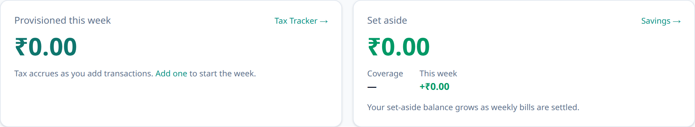

# Getting started

This page walks you from a fresh account to your first recorded transaction.

> **Just exploring? Try it with sample data first.** If you're running your own
> Aevum instance, you can generate realistic _synthetic_ statements (no real
> financial data), import them, and get a feel for the app risk-free — then
> [reset your data](your-data-and-privacy.md#reset-all-your-data) and start fresh
> from real statements when you're ready. See [Your data &
> privacy](your-data-and-privacy.md#just-exploring-use-sample-data).

## 1. Create your account

Sign up with your email and a password. Aevum uses your details to set sensible
defaults — for example, your currency is chosen from your country, so amounts
show up the way you expect from the start. You can refine everything later in
your profile and preferences.

## 2. Sign in

Log in with your email and password. If you've turned on two-factor
authentication, you'll also enter a code from your authenticator app — see
[Account & security](account-and-security.md).

## 3. Look around

After signing in you land on your **dashboard** — a summary of recent activity,
your current week's tax, and budgets. The top navigation takes you to
Transactions, Budgets, your bills, and Settings.

<picture>
  <source media="(prefers-color-scheme: dark)" srcset="images/screenshots/dashboard-initial-dark.png">
  
</picture>

## 4. Add your first transaction

Go to **Transactions → Add**. At minimum you'll choose:

- **Who** it was with (a _beneficiary_ — a merchant like "Coffee Shop", or a
  person),
- **How much**,
- **Whether it's money out (an expense) or in (income)**, and
- **The date**.

If you've set a rule for that beneficiary before, Aevum fills in the categories
for you automatically. Save, and you'll see it in your list.

That single transaction is enough for Aevum to start working — it categorizes
it, sets aside any consumption tax, and folds it into this week's bill.

## What next?

- Understand what that tax is: [The consumption tax](consumption-tax.md).
- Set a spending limit: [Budgets](budgets.md).
- Bring in lots of history at once: [Importing statements](importing-statements.md).

## FAQ

**Do I have to enter everything by hand?**
No — you can [import a statement](importing-statements.md) from your bank or UPI
app and Aevum will read the transactions for you.

**Can I change my currency later?**
Yes, in your preferences. It's just pre-filled from your country to save you a
step.

**I added a transaction — where did the "tax" come from?**
Aevum automatically applies a small consumption tax to most spending. The next
page explains exactly how it's calculated.
