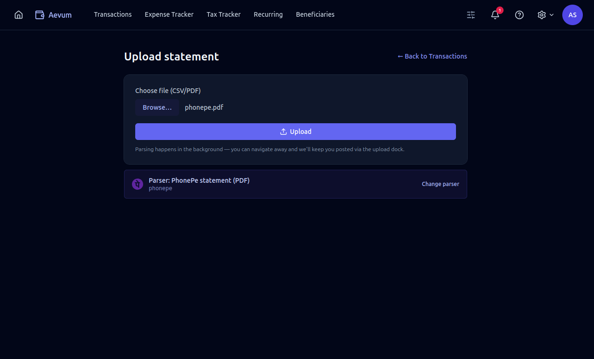
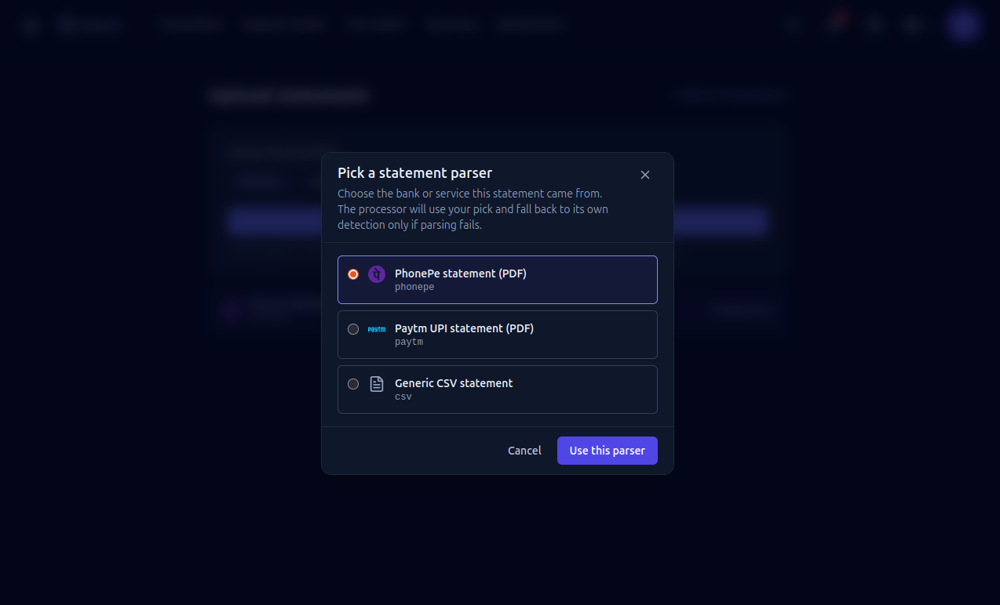
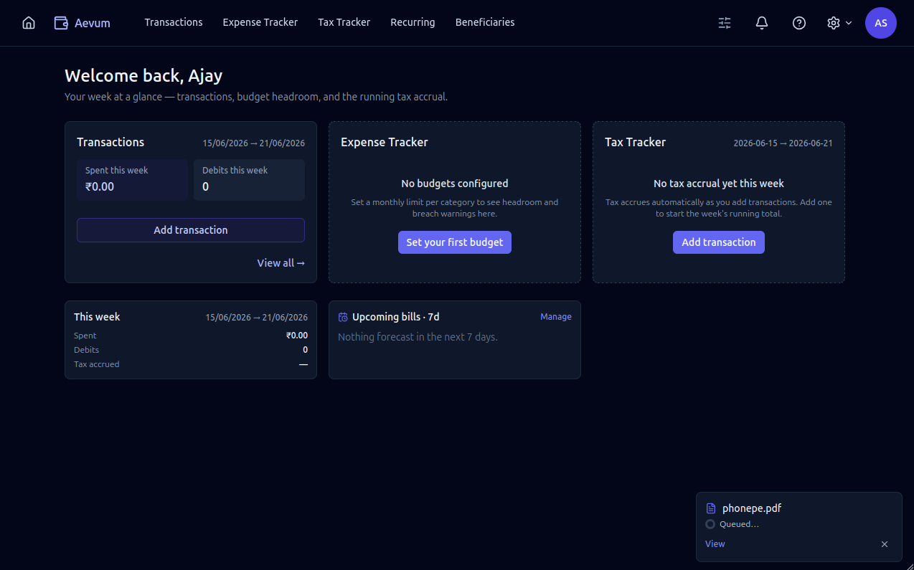
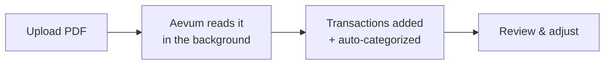

# Importing statements

Rather than typing in transactions one by one, you can upload a statement from
your bank or UPI app and let Aevum read it.

## Supported statements

Aevum reads PDF statements from popular UPI apps — **PhonePe, Google Pay,
Paytm**, and the list keeps growing. Pick the matching format when you upload (or
let Aevum detect it for you).

## How to import

1. Go to **Transactions → Import** (or the Upload Statement page) and choose your
   PDF.
2. Confirm the statement type. Aevum tries to match it automatically; if it
   can't, you pick from the list.
3. Submit. Importing happens in the background — you don't have to wait on the
   screen. You'll see the job move through _parsing → categorizing → done_, and a
   small dock keeps you updated from any page.
4. When it finishes, your transactions are in, already **auto-categorized** using
   your [rules](categories-and-rules.md) and attributed to the right account.

## After importing

Imported transactions behave like any others — they're taxed, counted against
budgets, and feed recurring detection. Anything Aevum couldn't confidently
categorize is left in a general state for you to tidy up, and you can re-tag any
imported transaction.

## FAQ

**My statement type isn't listed.**
Aevum supports the common UPI apps today and adds more over time. If detection
fails, choose the closest matching format manually.

**Is my statement stored?**
The import reads your statement to extract transactions; the goal is to get the
data into your ledger. Treat your statements as you would any financial document.

**Some imported transactions look uncategorized.**
That's expected when there's no rule for a beneficiary yet. Categorize them once
(or add a [rule](categories-and-rules.md)) and future imports will sort
themselves.
