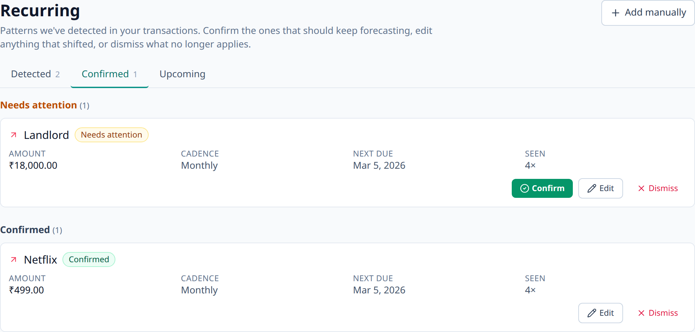

# Recurring bills

Some expenses repeat — rent, subscriptions, the monthly phone bill. Aevum learns
these from your history and forecasts them, so they never catch you off guard.

## How it works

You don't have to set recurring expenses up by hand. As you record (or import)
transactions, Aevum watches for patterns — the same beneficiary, around the same
amount, on a regular cadence (weekly, monthly, yearly) — and **forecasts the
next occurrences**.

Forecasts are predictions, not transactions: Aevum never invents spending in
your ledger. When the real expense happens, Aevum **reconciles** it against the
forecast so your actuals stay clean and your predictions stay honest.

## What you'll see

<!-- TODO: screenshot — forecasted recurring expenses (sample data) -->

- Upcoming recurring expenses Aevum expects, with their predicted dates and
  amounts.
- Reconciliation as those expenses actually land.
- Adjustments when your patterns change — a forecast that stops matching reality
  is revised or retired.

## Keeping control

Anything you manage yourself stays yours: Aevum won't silently overwrite a
recurring item you've taken control of. The automatic detection is there to help,
not to take the wheel.

## FAQ

**Does Aevum create transactions for recurring bills automatically?**
No. It forecasts them so you can see them coming; the actual transaction is
recorded when the expense really happens (by you, or via an import).

**How does it know something is recurring?**
From repetition in your history — same beneficiary, similar amount, regular
timing. The more history Aevum has, the better its forecasts.

**A forecast is wrong — what do I do?**
Patterns adapt over time as your real activity changes. Items you manage
yourself are never auto-modified.
