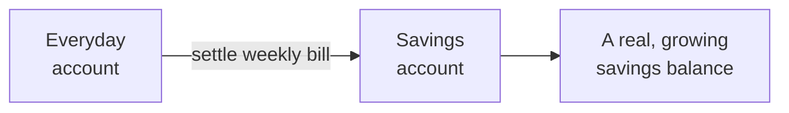

# Your savings account

The consumption tax isn't just a number on a screen — it goes somewhere. That
somewhere is your **savings account** (you may also see it called your *tax
pot*).

## Where the tax goes

When you settle a weekly bill, the money moves **out of your everyday account and
into your savings account**. So the discipline of the tax turns into a real,
growing balance — a provision you've built up for future expenses, one purchase
at a time.

## Paying your bill

You can settle bills two ways:

- **Manually** — record a payment against a bill when you move the money.
- **Automatically** — turn on auto-settlement and Aevum applies your savings
  transfers to your outstanding bills for you, oldest first.

Either way, the result is the same: the taxed amount ends up set aside in your
savings account.

> If bills pile up unpaid, Aevum will step in to protect you — it can pause
> auto-settlement and flag the backlog so things don't quietly spiral.

## Why we suggest two bank accounts

Aevum works best when your **everyday spending** and your **savings** live in two
separate real-world bank accounts:

- Every expense draws down your everyday account by **more than the sticker
  price** — the purchase *plus* its self-imposed tax. That shrinking balance is
  the point: less disposable income sitting around is a quiet, constant nudge to
  save rather than spend.
- The money you set aside lands in a dedicated savings account, out of sight and
  out of temptation. Its first job is to build an **emergency buffer** — a
  cushion for the unexpected — before any of it becomes money you invest.

You *can* run on a single account: designate one account as your savings /
emergency account in Aevum and mark bills paid when you actually move the money
aside (for example, into a fixed deposit within the same bank). But we
**strongly recommend two separate accounts** — physically segregating spending
from savings is what makes the discipline real and keeps your emergency fund from
being quietly spent.

## What's coming next

Today, the savings account is exactly that: a place your provisions accumulate.
It's also the **foundation for where Aevum is heading**. The plan is to grow it
from a passive store of savings into an active one — putting the balance you've
built to work through **investments and a portfolio**. When that lands, the same
account you've been filling with everyday discipline becomes the engine for
longer-term goals.

This guide will grow with those features. For now: every taxed purchase is
quietly building the balance they'll build on.

## FAQ

**Is the savings account a real bank account?**
It's a dedicated account *inside Aevum* that tracks your set-aside savings. You
move real money into it when you settle bills, so the balance reflects money
you've genuinely provisioned.

**Do I have to pay every bill?**
To keep your savings building, yes — that's the point. Auto-settlement makes it
effortless, and unpaid bills are flagged so nothing slips through.

**What's the "committee account" I saw mentioned?**
That's the name for this account's *future* role — once investing and portfolio
features arrive, it actively manages the balance rather than just holding it.
Same account, bigger job.
