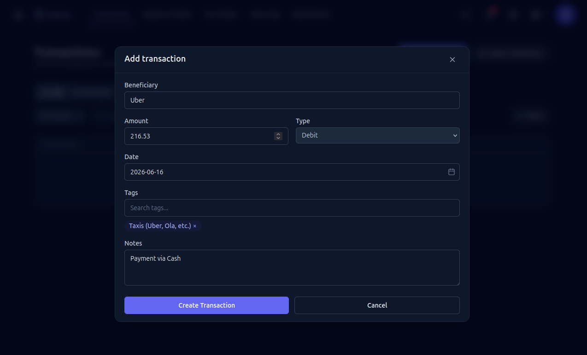
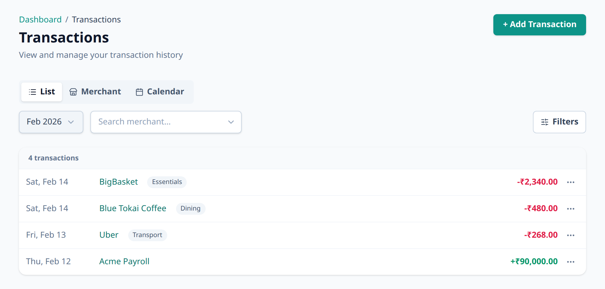
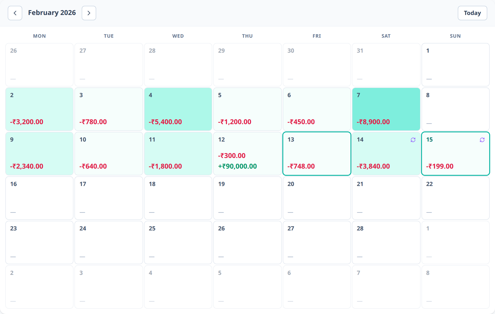

# Transactions

A transaction is any money that moves — an expense you paid or income you
received. Everything else in Aevum builds on these.

## Adding a transaction

Go to **Transactions → Add** and fill in:

- **Beneficiary** — who the money was with. This is either a **merchant** (a
  shop, service, or business) or a **person**. Start typing and pick an existing
  one, or add a new one on the spot.
- **Amount**.
- **Type** — money out (an expense) or money in (income).
- **Date**.
- **Categories (tags)** — usually filled in for you (see below).
- **Notes** and, optionally, which **bank account** it came from.

### Categories fill themselves in

If you've set a [rule](categories-and-rules.md) for that beneficiary, selecting
them **auto-fills the categories**. You can accept them as-is, or adjust them for
this one transaction. If you change them, Aevum asks whether you want to:

- **use the change for this transaction only**, or
- **update the rule** so it applies next time too.

That keeps your one-off tweaks from quietly rewriting a rule you rely on.

## Editing and deleting

Open any transaction to edit it. Changing its amount or categories updates your
tax and budgets automatically — including the current week's bill. You can also
delete a transaction; transactions that came from an imported statement are
handled a little differently (you re-categorize rather than delete).

## Viewing your transactions

The Transactions page lists everything with filtering, sorting, and search. You
can also view spending grouped by beneficiary to see where your money actually
goes.

## FAQ

**What's a "beneficiary"?**
Just the other side of the transaction — the merchant you paid or the person you
sent money to. Grouping by beneficiary is how Aevum learns your patterns and
auto-categorizes future spending.

**I record income too?**
Yes. Income isn't taxed, but recording it gives you the full picture and helps
with budgets and recurring detection.

**Why did my weekly bill change when I edited a transaction?**
Because the tax is calculated live. Editing a transaction in the current week
recalculates that week immediately; editing one in a finalized week posts a
small adjustment to the current week instead.
