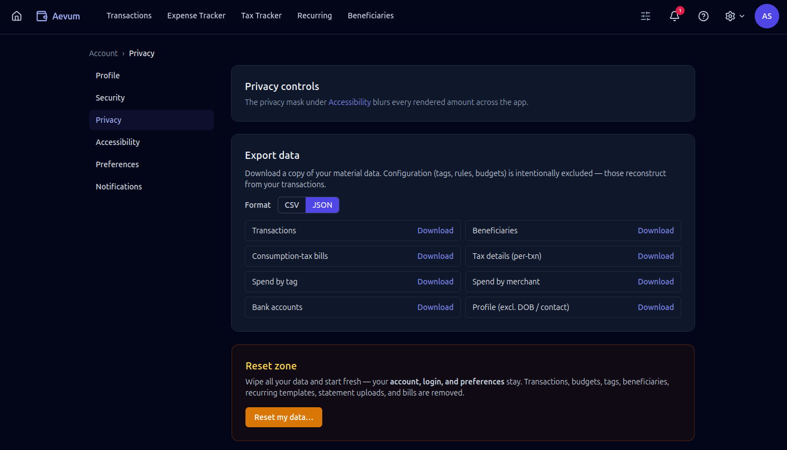
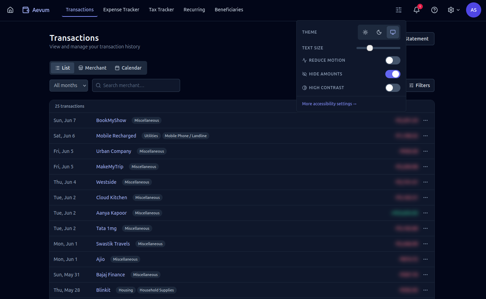

# Your data & privacy

Aevum holds a detailed picture of your finances, so you should know exactly what
you can do with that data and what happens to it. This page lays it out plainly.

## Your data is yours

Everything you put into Aevum — transactions, beneficiaries, categories, budgets,
bills — belongs to you, and Aevum gives you direct control over it: export it,
hide it on screen, delete parts of it, reset all of it, or close your account
entirely.

It's also protected: your password is bcrypt-hashed (never stored in readable
form), 2FA secrets are encrypted at rest, and sign-in is rate-limited and
lockout-protected — see [How Aevum protects your
account](account-and-security.md#how-aevum-protects-your-account). The rest of
this page is about the controls _you_ have over your data.

## Just exploring? Use sample data

You don't have to hand over a single real number to find out whether Aevum is for
you. If you're running your own instance, you can generate realistic **synthetic**
statements (made-up payees and amounts — no personal data), import them, and play
with the full app risk-free. When you're ready for the real thing, do a [data
reset](#reset-all-your-data) and start fresh from your actual bank statements.

The generator and steps are in [CONTRIBUTING](../CONTRIBUTING.md#try-aevum-with-sample-data).

## Export your data

You can export your data at any time as **CSV** (for spreadsheets) or **JSON**
(for developers and backups). Exports are per-resource — your transactions, your
beneficiaries, and so on — so you can take exactly what you need.

## Mask amounts on screen

Turn on **amount masking** to blur every monetary value in the app — handy when
you're on a train, sharing your screen, or just don't want your balances visible
at a glance. Masked amounts reveal when you hover or focus on them, so you can
still check a figure when you need to without unmasking everything.

## Delete individual things

You don't have to wipe everything to remove something. You can delete a single
**transaction**, a **beneficiary**, account details, and other individual records
directly — useful for cleaning up a mistaken entry or removing a record you'd
rather not keep.

## Reset all your data

A **data reset** is a clean restart: it wipes every piece of financial data you
own — transactions, bills, budgets, categories, recurring forecasts — while
keeping your **account itself** (your login, profile, and preferences) intact.
Think of it as emptying the app back to day one without having to sign up again.

> A reset is irreversible. If you only want to step away, you don't need to reset
> — your data simply waits for you.

## Delete your account

You can close your account entirely. Deletion has a grace period, so you can
change your mind and cancel within the window before anything is permanently
removed — see [Account & security](account-and-security.md#deleting-your-account).

## What's kept after deletion — and why

Closing your account removes your personal data, with one deliberate,
narrow exception you should know about.

Because Aevum's consumption tax corresponds to **real money you actually set
aside**, your tax/bill records aren't purely cosmetic — they reflect genuine
financial activity the app guided. For **legal and regulatory compliance**, a
minimal record is retained after deletion:

- **Bill-level taxation records** — the books of what was billed (these must
  survive an account closing, the way a ledger outlives any one member).
- **An overall spend rollup** — a single high-level total, with **no
  per-category detail**.
- **Your email address** — kept only for authorized future correspondence.

Everything else that identifies you is dropped. This retained record is the
narrow exception to "delete means gone" — and it exists specifically because the
data maps to real-world transactions, not to keep tabs on you.

## FAQ

**Can I get all my data out before I leave?**
Yes — export to CSV or JSON first, then reset or delete. Your export is a full
copy you keep.

**Does masking amounts hide them from Aevum, or just from the screen?**
Just from the screen — it's a display setting for privacy in public or shared
situations. Your data is unchanged; hover or focus to peek at a value.

**If I reset my data, do I lose my account?**
No. A reset clears your financial data but keeps your account, profile, and
preferences. To remove the account itself, use account deletion.

**Why is anything kept after I delete my account?**
Only the minimum required for compliance, because your tax bills reflect real
money set aside. It's a small, fixed record (billing totals + your email), not
your full history.
