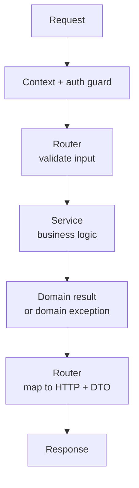

<!-- AUTO-GENERATED — byte-faithful mirror of aevum-api@6b1e4989/docs. Edit at source, not here. -->

# How the backend works

Aevum's backend is a personal-finance engine built on **FastAPI**, running on an
**async-only** Python stack over **PostgreSQL**, with Redis for caching, locks and
rate limiting. This page explains the machinery at a mechanics level — the shape of
the system and how a request turns into a domain decision — without dropping into
implementation detail.

## Feature-based ("screaming") architecture

The codebase is organized by **business capability**, not by technical layer. Every
feature — transactions, taxation, budgets, auth — owns its own models, request
schemas, business logic and routes in a single self-contained module. Open the tree
and it "screams" what the product does, rather than showing a generic web-app
skeleton.

Modules are deliberately isolated. A feature never reaches into another feature's
data directly; it goes through that feature's **public service layer**. So a change
to one domain's internals can't quietly ripple into another. Infrastructure that
every feature needs (the database engine, cache, scheduler, object storage) lives in
a thin **core** tier; ownerless helpers that several features share (period math,
serial allocation, cryptographic primitives) live in a **shared** tier between core
and the features. The dependency direction is strict and one-way: core ← shared ←
features.

## Async all the way down

Everything on the request path is asynchronous — the web framework, the database
driver, and every service. A request never blocks the event loop; the rare piece of
blocking work (parsing a PDF statement, touching the filesystem) is offloaded to a
worker thread so one slow operation can't stall every other in-flight request.

## The model registry

Each feature defines its own data models, but they all share a single declarative
base, so the whole schema lives in one logical registry. Relationships that cross
feature boundaries are declared by name and resolved centrally, which means two
features can reference each other's data **without importing each other's code** — no
circular dependencies, no runtime coupling between modules.

## The request lifecycle

Every request follows the same path, and each layer has exactly one job:

1. Middleware stamps a request id and the authentication guard resolves the caller.
2. The **router** validates the incoming body against a typed schema.
3. The router hands off to a **service**, which owns all business logic and the
   database transaction.
4. When something goes wrong, a service raises a **domain exception** (a
   business-meaningful failure, not a raw database error); the router translates it
   into the right HTTP response. Anything unhandled is caught by a global handler
   that returns a safe error envelope, so an internal fault never leaks a stack
   trace.
5. Data leaves only through an explicit response object that omits sensitive fields —
   a raw model is never serialized directly.

Anything that has to happen on a schedule (finalizing weekly bills, inferring
recurring patterns, cleanup) runs on an in-process scheduler as a background worker,
never on the request path.

## The consumption-tax engine — the domain heart

The flagship mechanism is a **consumption-tax engine**: Aevum charges the user a
small, self-imposed tax on their own spending and moves that money into a savings
account. The intent is *forced provisioning, not punishment* — every taxable spend
quietly sets aside a provision for future expenses of the same kind, and a budget
breach adds a marginal penalty on top.

Almost everything else in the backend exists to feed this engine a correct answer:
categorization decides what a transaction *is*, budgets decide whether it *breached a
limit*, and the tax engine turns that into money owed and then settled. Its full
mechanics are their own page — [the consumption-tax
engine](the-consumption-tax-engine.md) — and the supporting machinery is described in
[how the pieces fit](how-the-pieces-fit.md).

## The modules, by role

**Core infrastructure & shared helpers**

- **core** — the database engine, cache, scheduler, object-storage seam and request
  wiring every feature builds on.
- **shared** — ownerless helpers used across features: period math, durable serial
  allocation, hashing and encryption primitives.

**The transaction & tax pipeline**

- **transactions** — the raw ledger: what the bank or user actually said happened,
  and the async statement-import path.
- **ledger_pipeline** — the single road into the ledger; stages, de-duplicates and
  resolves every transaction in one guaranteed order.
- **categorization** — assigns each transaction its category tags from per-user
  rules.
- **taxation** — the consumption-tax engine: what's taxable, how much, and the weekly
  bill.
- **budgets** — per-category limits and the spend read-model the tax engine reads to
  detect a breach.
- **treasury** — the accounting view over set-aside cash; an append-only, auditable
  revenue journal.

**Supporting features**

- **tags** — the per-user hierarchical category tree whose typed nodes drive tax.
- **beneficiaries** — every counterparty, resolved from raw statement text.
- **relationships** — the standing edges linking a user to a counterparty.
- **registry** — a system-wide catalog of known businesses that users lease from.
- **bank_accounts** — the user's own accounts, including the savings pot bills settle
  into.
- **recurring** — an inference engine that learns repeating expenses from history.
- **activity** — a registry-driven feed that surfaces per-user signals and alerts.
- **payments** — the UPI initiate-and-record rail.

**Identity & lifecycle**

- **auth** — sign-in, sessions, device binding, two-factor and recovery.
- **users** — the person, their profile and the preferences that gate features.
- **onboarding** — the first-run setup journey and the sample-data demo.
- **notifications** — the single outbound transactional-email path.
- **admin** — the operator-only portal composed from other modules' services.
- **metadata** — a read-only reference surface for the frontend.
- **exports** / **cemetery** — data export, and a retention island that survives
  account deletion.
