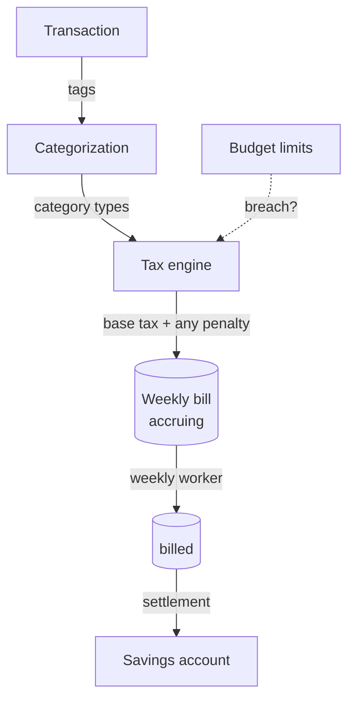
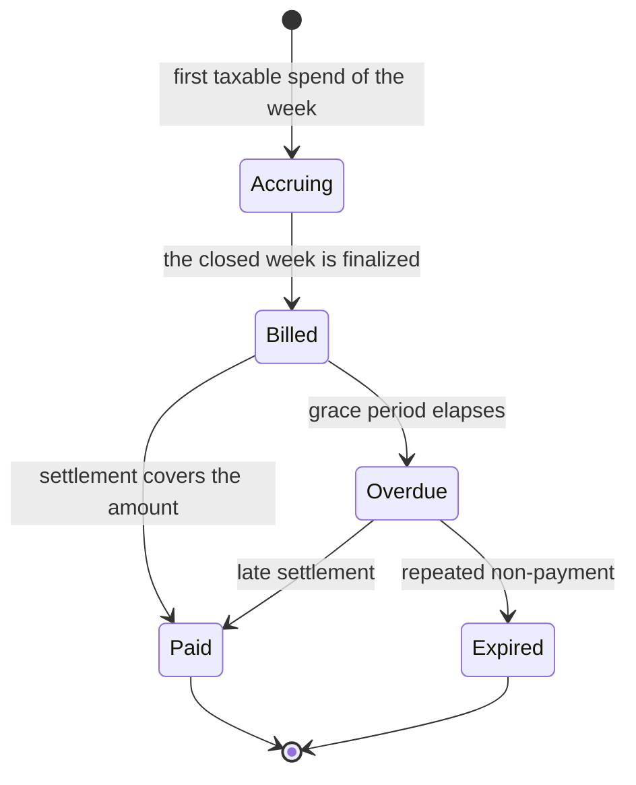

<!-- AUTO-GENERATED — byte-faithful mirror of aevum-api@7d29cf50/docs. Edit at source, not here. -->

# The consumption-tax engine

This is Aevum's flagship mechanism. The product charges the user a small,
**self-imposed** tax on their own spending and moves that money into a savings
account. The framing matters: it is *forced provisioning, not punishment*. Every
taxable spend sets aside a little money so the user builds a provision for future
expenses of the same kind — the base tax is not a penalty and is not conditional on
doing anything wrong.

The single most common misreading is that the tax only applies to overspending. It
does not. The base tax applies to **every taxable spend**. A budget breach adds a
*penalty on top* — that is the only thing a breach does.

## The mental model

Four things happen, in order, and each is a different part of the system's job until
the last:

1. A transaction is **categorized** into hierarchical tags — the job of the
   categorization engine, not this one.
2. Each category carries a *type*. The engine derives the transaction's own type from
   those category types **by precedence**: an exempt category wins outright, then
   committed beats essential beats discretionary. This one derived type is what the
   tax is based on.
3. The engine applies a rate to the amount. Types fall into three groups: **taxable**
   (committed, essential, discretionary, and anything still uncategorized) accrue tax;
   income, internal transfers, the tax itself, and exempt spend are **skipped**; and a
   **rebate** — a refund, cashback, or reimbursement — *deducts*, booking a negative
   amount of tax at the reversed spend's own category rate, so money coming back also
   returns the self-tax that spend set aside.
4. If the spend breached a budget, a **penalty** is stacked on top of the base tax.

Rates are **per-user, tunable values**, not hard-coded constants. The defaults ship
conservative — committed spend starts zero-rated but sits in the taxable set so a
user can raise it, essential spend a little, discretionary and uncategorized spend
more — and the user moves them from there.

## A real-time incremental ledger

The engine is **not** a batch job that wakes up once a week and tallies everything.
Every time a transaction is created, edited or removed, the engine recalculates that
week's running tax **synchronously**, inside the same operation that changed the
transaction. The user watches their accruing tax move as they spend, rather than
discovering it after the fact. The weekly worker exists only to *finalize* a closed
week and to re-run settlement as a safety backstop — it does not do the primary math.

## The weekly bill and its lifecycle

Spending accrues into a **weekly bill**, and a week is always **ISO 8601, Monday to
Sunday, in the user's own timezone** — a convention applied consistently across the
whole product, never computed ad hoc.

A bill moves through a small, well-defined lifecycle:

- **Accruing** — the live, current week, still moving as the user spends.
- **Billed** — the week has closed and the amount is now owed, with a grace period to
  settle it.
- **Paid** — enough has been moved into savings to cover the bill.
- **Overdue** — the grace period elapsed without settlement.
- **Expired** — a bill that went unpaid long enough to be written off; if these pile
  up, a stacking defense steps the engine down to a safer mode rather than silently
  continuing.

The engine has an overall mode with three settings: **off** (the tax is disabled and
Aevum acts as a plain expense tracker), **manual** (bills accrue but the user
finalizes and settles them), and **auto** (the weekly worker finalizes on the user's
behalf). Safety fallbacks only ever *step down* toward manual — turning the feature
fully off stays a deliberate user choice.

## Marginal breach penalties

The budget penalty is **marginal**, not all-or-nothing. Within a given budget
category and month, spending stays at the base rate until the *cumulative* spend
crosses the limit; the transaction that crosses it — and every later one that month —
carries the extra penalty. Earlier transactions are untouched. Because the running
total is net of refunds, a refund genuinely *un-breaches* a budget and future
spending drops back to the base rate.

## Settlement into savings

A bill is settled by the user moving money into their designated savings account. The
engine records that settlement as an **allocation against the bill** — it never
invents a transaction of its own. This is deliberate and load-bearing: the ledger
only ever contains money that actually moved, so it stays honest. Settlements can
happen two ways — the user paying a specific bill, or money flowing into the savings
account being matched automatically against the oldest outstanding bills first — and
both are recorded the same way.

## Corrections don't rewrite history

Once a week is finalized, its bill is **frozen** — its rows are never edited again.
This is what makes a past bill auditable: it must always show the state that produced
its number.

So how does the engine handle a user editing a transaction that belongs to an
already-closed week? It doesn't reach back and mutate the old bill. Instead it posts
a **correction** onto the *current* accruing bill — a separate adjustment line that
carries the difference the edit made, along with a before-and-after view of what
changed. Repeated edits to the same transaction **telescope**: each new adjustment is
measured against the prior ones, so corrections can never double-count. To keep the
inputs verifiable, a frozen bill captures the exact values that *determined* the tax
at the time; only display labels stay linked live, so a later rename still shows
through.

The result is a ledger where the historical record is immutable, every correction is
an explicit, traceable line rather than a silent overwrite, and the numbers always
add up.
