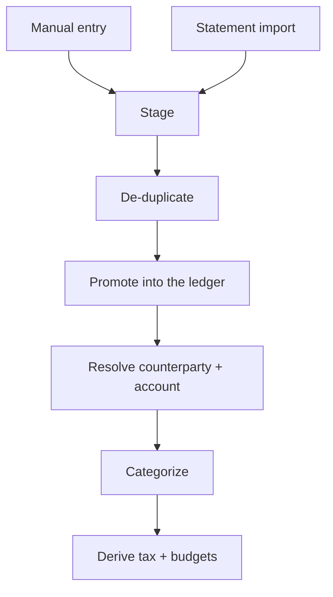

# The resolved ledger

The [consumption-tax engine](the-consumption-tax-engine.md) can only be trusted if the
money underneath it is trustworthy. That trust comes from one architectural commitment:
a transaction is a **raw record of what a bank or a user actually said**, and everything
derived from it — which category it belongs to, what tax type it carries, whether it
breached a budget, who the counterparty was — is computed *around* the raw record, never
baked *into* it. This is the single largest design decision in the backend, and this
page explains why it is shaped the way it is.

## Raw purity

A transaction stores only the facts that came in from the source: the amount, the date,
the direction of the money, the original description. It does **not** store the answers
to any of the questions those facts provoke. Who was this with? Which account did it
touch? What kind of spend is it? Those are **resolutions** — derived, revisable facts —
and they live in their own engine-owned tables alongside the raw row, never as fields on
it.

The reason is durability. The raw record is the one thing that must never change, because
it is the closest thing the system has to ground truth. If a categorization rule
improves, if a payee is renamed, if the tax rates are retuned, none of that is allowed to
touch what the bank originally said. A pristine raw record stays **replayable** forever:
every derived fact can be recomputed from it at any time, and if a derivation is ever
wrong, the fix never risks corrupting the source.

A resolution can also **fail**, and the system treats a failure as a first-class answer.
When the engine looks for a counterparty and cannot identify one, it records *that it
looked and could not tell* — an explicit "unknown", distinct from "nobody has looked yet".
The two are worlds apart: conflate them and an unattributed transaction silently vanishes
from a report instead of showing up as honestly uncategorized. Under-reporting a user's
own spending is the worse failure, so nothing is ever dropped for want of a resolution.

## One road into the ledger

Every transaction enters through the **same single pipeline**, whether it was hand-entered
one at a time or imported a thousand at once from a bank statement. There is exactly one
road, and it runs in one guaranteed order.

Both entry points converge on one baton. Incoming rows are first **staged** in a holding
area, then **de-duplicated**, then **promoted** into the raw ledger, and only then
**resolved, categorized, and taxed**. Because there is a single road, every row — no
matter which door it came through — is subject to identical de-duplication and identical
resolution in an identical sequence. There is no second, sloppier path for the "quick"
manual case.

De-duplication deliberately defers to the user, because only the user knows the truth.
Within one statement import a repeated-looking charge is treated as two genuine purchases
— a bank does not list the same transaction twice — so it imports and simply notifies.
Across *separate* imports the same-looking charge might be a real duplicate and might not,
and the system cannot know, so it holds the row and asks rather than guessing. Either way,
nothing is discarded.

The same road runs in a **dry-run mode**: it can stage, resolve, and compute every derived
figure inside a transaction that is rolled back at the end, producing a complete preview
without ever writing a row. The demo and preview surfaces are built on exactly this.

## Derivations are engine-owned and recomputed

Because derived facts are never stored on the raw row, they can never *drift* from it. A
category, a tax type, a breach status is recomputed by the engine that owns it, through a
**single shared recompute step** that both the ingestion path and every later edit run
through. There is no hand-wired refresh scattered across the code that someone can forget
to call and leave a stale number behind. Change a transaction and its derivations are
recomputed atomically, in the same operation — the raw ledger and everything derived from
it commit together or not at all.

This is the payoff of raw purity made concrete: since a derivation can always be recomputed
from the source, the system is free to treat every derived figure as disposable and
rebuild it, rather than storing it and defending it against staleness forever.

## The disciplines that keep it auditable

Three durability rules keep the ledger honest over time. Each exists so that **nothing is
ever silently overwritten**.

- **Append-only journals.** An accounting read-model that must be reconstructable — the
  savings/revenue view is the reference case — is kept as an append-only sequence of signed
  entries, never a mutable running total. A correction is another signed entry, not an edit.
  Every figure is a pure sum over the journal, so the whole thing can always be rebuilt and
  audited from its own history.
- **Soft-void over hard-delete.** A transaction is never truly deleted. Deleting one marks
  it void and **preserves the row**, including its original amount, for the audit trail.
  Voided rows simply drop out of every list and every total, so the live view stays clean
  while history stays intact.
- **Frozen rows with live labels.** Once a period is finalized, the rows that recorded its
  outcome are **frozen** — the exact values that determined a past result are captured at the
  time and read back from the frozen row forever, so a later edit to the source can never
  rewrite what a closed bill said. Only pure display labels stay linked live, so a rename
  still shows through; and when a labeled row is genuinely deleted, a small fallback keeps
  the name resolvable rather than leaving a blank. History you can verify; labels that stay
  current — without letting one corrupt the other.

Together these turn "the numbers add up" from an aspiration into a property of the
architecture. The raw record is immutable and replayable; every derived figure is
recomputed, never stored-and-drifting; and every correction is an explicit, traceable line
rather than a silent overwrite.

See also [how the pieces fit](how-the-pieces-fit.md) for the engines that feed and read
this ledger, and [the consumption-tax engine](the-consumption-tax-engine.md) for the
mechanism it exists to serve.
