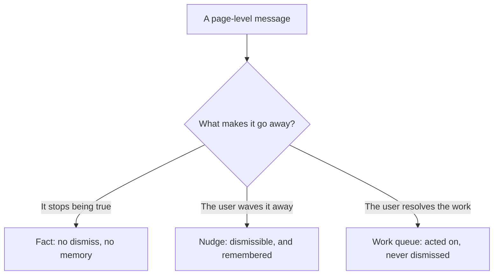

# Interaction Patterns

Most of what makes an app feel like one product rather than a pile of screens
is not visual — it is behavioral. Aevum's frontend composes every screen from a
small set of reusable interaction patterns, so a user who learns one screen has
effectively learned them all. Each pattern below exists to hold a single rule:
one source of truth per interaction. The visual layer lives in
[the design system](the-design-system.md); how the code is organized lives in
[how the pieces fit](how-the-pieces-fit.md).

## The page skeleton

Every top-level screen is built on the same shell: a breadcrumb trail that shows
where you are, a page header that names the screen, and a single shared
width constraint that keeps content from sprawling on wide monitors. Because the
shell is one shared thing rather than markup each screen re-types, screens can't
quietly drift out of alignment with one another — the header sits in the same
place, the content column is the same width, and adding a new screen means
adopting the shell, not rebuilding it.

## Modal-first CRUD

Creating, editing, and viewing a record happens in a shared modal layered over
the list it belongs to — not by navigating away to a separate page. The reasons
are consistency and context: the user never loses their place in the list behind
the modal, the interaction opens instantly with no page transition, and on a
narrow phone screen a full-height modal reads exactly like a page anyway. One
shared modal component carries the hard parts — focus trapping, escape-to-close,
scroll locking, and a guard that confirms before discarding unsaved edits — so no
feature re-solves them and none gets them subtly wrong.

## The canonical view-and-edit surface

For each kind of record there is exactly **one** surface that both shows
everything about an item and edits it — reached the same way everywhere, by a
quiet control on the row. There is no separate "view page" and "edit dialog" to
keep in sync; whether a given field can be changed is a property of that field,
not of a mode the user toggles. This collapses what would otherwise be three
divergent screens into a single place, so the layout a user sees on open is the
same one they edit in, and nothing can disagree with anything else.

## Searchable lists with inline create

When a form asks the user to pick from a list they are also allowed to extend,
finding and adding live in one flow: the user types to filter, and an add option
stays visible at the top of the results — including when nothing matches, which
is exactly when they most need to create something new. Picking an existing entry
selects it; adding a new one opens the owning feature's small create dialog,
then folds the result straight back into the selection. The user never has to
leave, remember what they were doing, and come back.

The related closed-list case — a large fixed catalog the user can pick from but
not add to — uses a searchable dropdown instead. Both are built from one shared
typeahead behavior, so filtering and keyboard navigation feel identical wherever
a picker appears.

## Transactional settings edits

Some settings ripple across the whole app — change the currency and every amount
reformats; change the timezone and every date shifts. Those high-impact,
tightly-coupled choices are grouped behind a settings surface that **stages**
edits and commits them together on save, with a clean read-only summary the rest
of the time. Low-impact, independent toggles stay inline and apply the instant
they're flipped. The dividing line is blast radius, not the kind of control: a
change big enough to reshape the screen earns an explicit, atomic commit.

## Destructive actions belong in the edit surface

When an item can be deleted, the remove action lives inside the same surface that
edits it — a distinct, clearly-marked control, never mixed in with the save and
cancel buttons. Removal always routes through an explicit confirmation, and when
an item genuinely can't be deleted the action is simply absent rather than
present-but-disabled, which would imply it might work later. When only the server
can know whether a delete is safe, the surface offers the always-safe
alternative up front and re-frames to it if the server refuses — so the user is
never dropped into a dead-end error they can't act on.

## A fixed banner vocabulary

Page-level messages draw from a small, fixed set of severities so messaging stays
consistent and honest. The organizing question is not how a banner looks but what
makes it go away:

A fact vanishes on its own when its condition clears. A nudge can be dismissed —
and the dismissal is remembered, because a dismiss the app forgets is worse than
no dismiss at all. Work that must be dealt with cannot be waved away, because
hiding a queue doesn't empty it. Classifying by that one question keeps messaging
from either nagging or quietly hiding something that mattered.

## Feedback affordances

When a save closes a modal back onto a list, the row that just changed briefly
glows and, if needed, scrolls into view. This is deliberate: a modal closing into
a re-rendered list is disorienting, so the app points the user's eye straight at
what changed instead of making them re-scan the table. The same attention cue is
the standard way to highlight one item after a cross-page redirect. Reduced-motion
users get a static version — the cue never depends on animation to do its job.

## Two structural rules

**Redirect over nested modal for full features.** A lightweight sub-task — minting
a missing tag while filling a form — can open a small dialog on top of the current
one. But when the sub-flow *is* a complete feature with its own screen, the app
navigates to that screen carrying the in-progress context, rather than stacking a
whole feature inside a modal. This keeps feature boundaries clean and avoids
disorienting modal-on-modal depth.

**Accessibility versus preferences.** Display settings split by where they belong.
Device-shaped switches — theme, text size, reduced motion, the on-demand privacy
mask — stay on the device, because the right value on a laptop may be wrong on a
phone. Account-shaped preferences — currency, timezone, formats, and the display
choices that are properties of the *person* rather than the screen — follow the
user everywhere they sign in. The distinction decides where each setting is
remembered, so it always comes back where the user expects it.
