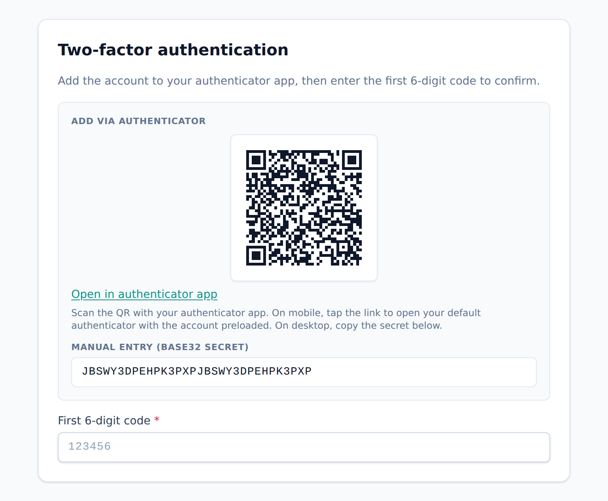

<!-- Tier: T0 · product · users. Assembled at aevum-finance by merging the backend + frontend
     lane T1 docs into one product narrative. The prose here is authored; the provenance block
     below is generated (tooling/build-public.mjs). Keep this page free of tier labels and
     internal paths — a reader must never be shown which module or bucket its content came from. -->

<!-- BEGIN GENERATED:provenance -->
<!-- Product topic "Account & security". Reconciles these mirrored lane T1 docs
     (edit at source; reconcile the merge here):
     backend:  auth (sign-in, tokens, 2FA, recovery, device challenges) -> ../internal/backend/public/auth.md
              users (profile, preferences, account reset) -> ../internal/backend/public/users.md
     frontend:  auth (sign-in, 2FA, recovery, and the device-bound token machinery) -> ../internal/frontend/public/auth.md
              account (the /account/* profile, security, privacy and settings area) -> ../internal/frontend/public/account.md -->
<!-- END GENERATED:provenance -->

# Account & security

Your account holds your whole financial picture, so getting into it is meant to be quick for you and genuinely hard for anyone else. This page covers who you are, how the app works for you, and everything that stands between a stolen password and your money.

## Two kinds of "you"

Aevum keeps two separate pictures of you, because they change for different reasons.

One is **who you are**: your name, date of birth, country, contact number, and the picture you show. The other is **how you like the app to work**: your currency and timezone, how dates and numbers are formatted, where you land when you open the app, and how Aevum handles tax and budgeting for you.

Keeping them apart means a quick change to a preference never touches your identity, and updating your details never resets how the app behaves. Everything shows read-only at a glance in your account area — you edit any card by opening its Change or Edit button, so you never type into a form by accident.

## Your details and your picture

Your name, date of birth, contact and country live on your profile. Your **email address is your login**, so changing it is handled separately, with a confirmation step, rather than as a casual edit.

When you first sign up, Aevum uses your **country** to pick sensible defaults — your currency and how dates and numbers are formatted. Adjust any of them afterwards; the country is just the starting point.

For your picture you have three choices, and only one is ever active:

- **Your initials** — the simple default, if you set nothing.
- **A generated portrait** — pick a style from a gallery (with a Shuffle to try variations) and Aevum draws one on the spot. Nothing is uploaded.
- **A photo you upload** — Aevum resizes it, strips hidden camera data for your privacy, and stores a tidy copy.

Choosing a portrait clears any uploaded photo, and uploading a photo clears the portrait — so there's never any confusion about which is showing.

## The settings that shape your money

Two settings decide how the core of Aevum behaves for you, and each has three positions: **off**, **manual** (Aevum does the work, you take the final step), or **automatic** (Aevum runs it end to end). One controls the [self-imposed tax](consumption-tax.md); the other controls [budgeting](budgets.md). Turn either off and that part of the app steps aside, leaving plain expense tracking. You're always in control of both.

## Creating your account

Signing up asks for just an email and a password. Before your account opens, we email you a short code to confirm the address is really yours — so nobody can create an account in your name, and a typo can't lock you out later. Everything else is set up afterwards in a short guided walkthrough (see [getting started](getting-started.md)). Prefer to skip the password? You can sign in with **Google or GitHub** instead, where available — those accounts are already confirmed by the provider, so they go straight through.

## Signing in

Enter your email and password and you're in. Depending on how you've secured your account, Aevum may ask for one more thing first — a code from your authenticator app, or a one-time code we email you on a device we haven't seen before. Each is a deliberate checkpoint, not a hurdle for its own sake, and once you've cleared it that device is remembered.

Behind the scenes, your session is kept safe without leaving keys lying around: your device is recognised by a private key that never leaves it and can't be copied elsewhere; the credential that proves who you are lives in your browser's memory only, so it disappears when you close the tab; and if you're inactive long enough, your access quietly expires and is renewed in the background.

## Two-factor authentication

**Two-factor authentication** (2FA) adds a second lock: even someone who knows your password can't get in without a rotating code from your authenticator app (Google Authenticator, Authy, and the like). You set it up once by scanning a QR code, and Aevum gives you a set of **backup codes** to save somewhere safe — each works once and is your way back in if you lose your phone. Because 2FA is enforced everywhere, even resetting a forgotten password still asks for it, and turning 2FA off again requires your password, so nobody can quietly disable it.

<picture>
  <source media="(prefers-color-scheme: dark)" srcset="images/screenshots/2fa-setup-dark.png">
  
</picture>

## Trusted devices and sessions

The first time you sign in from a new phone or computer, Aevum emails a one-time code to confirm it's you. Once entered, that device becomes **trusted** and won't ask again — and the same email carries a one-click link to shut down the attempt if it wasn't you. You can review every place you're signed in, see your trusted devices, and sign out or forget any of them from your security settings. You can be signed in on several devices at once; sign in on a great many and the oldest sessions are quietly retired.

## If you forget your password

Reset it from the sign-in screen. Aevum confirms it's really you first — through the **security question** you set up, a **one-time emailed code**, or both — before letting you set a new one. If you use 2FA, that still applies at the end, so a reset can't be a shortcut around it. To stop guessing, recovery locks itself for a while after several wrong attempts, and the wait grows each time; the quickest fix is to wait it out, or simply sign in normally if you remember your password, which clears the block. For your privacy, recovery screens never reveal whether an email has an account.

## Changing your email or password

- **Changing your password** signs you out of your _other_ devices, so a forgotten session can't linger. We email you to confirm.
- **Changing your email** takes your password (and a 2FA code, if you use 2FA), sends a confirmation code to the _new_ address, and notifies your _old_ one — so a change can never happen silently behind your back.

## We keep you informed

Aevum emails you when something that matters to your account's security happens — a sign-in from a new device, a password change, an email change. If one of those is ever about something you didn't do, it's your early warning, and the tools to lock things down are right there in your settings. You choose which in-app alerts you receive too; see [notifications](notifications.md).

## Managing your account

Exporting your data, masking amounts on screen, wiping your data for a clean restart, and deleting your account all live under **your data & privacy** — see [your data & privacy](data-and-privacy.md). Deletion always has a grace period: you're signed out immediately and emailed a link to undo it before anything is permanently removed.
