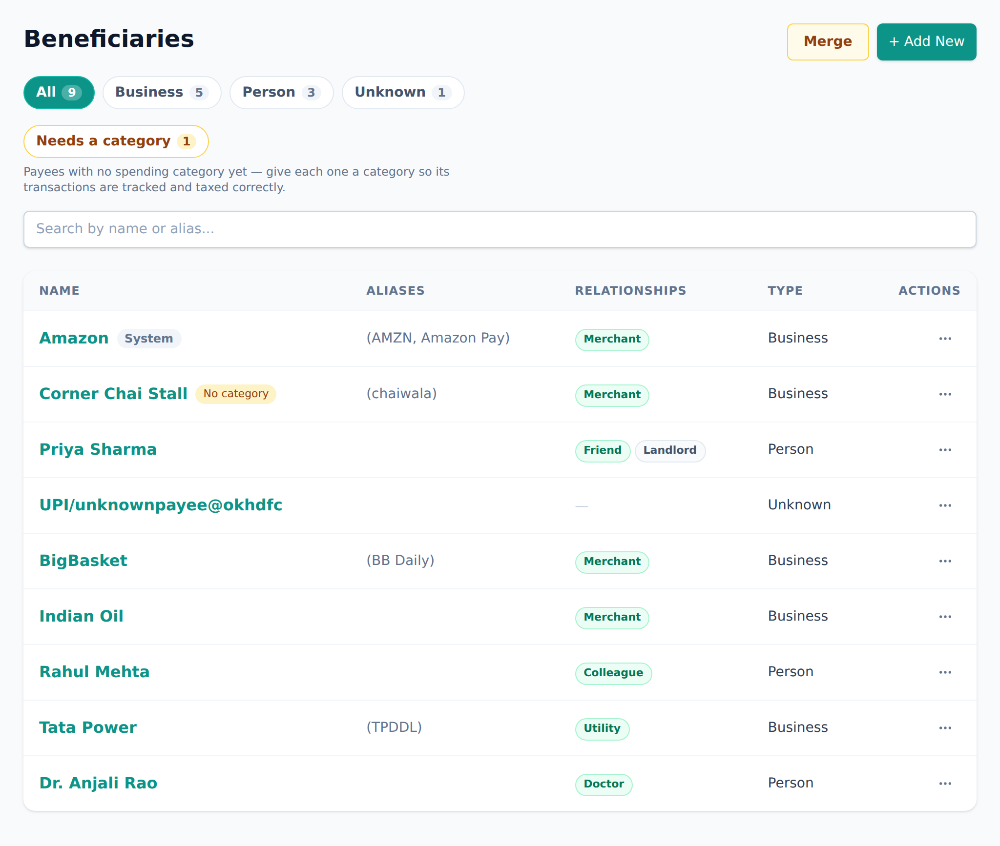

<!-- Tier: T0 · product · users. Assembled at aevum-hub by merging the backend + frontend
     lane T1 docs into one product narrative. The prose here is authored; the provenance block
     below is generated (tooling/build-public.mjs). Keep this page free of tier labels and
     internal paths — a reader must never be shown which module or bucket its content came from. -->

<!-- BEGIN GENERATED:provenance -->
<!-- Product topic "Beneficiaries". Reconciles these mirrored lane T1 docs
     (edit at source; reconcile the merge here):
     backend:  beneficiaries (the merchants and people a transaction is with) -> ../internal/backend/public/beneficiaries.md
     frontend:  beneficiaries (the merchants and people you pay) -> ../internal/frontend/public/beneficiaries.md -->
<!-- END GENERATED:provenance -->

# Beneficiaries

A **beneficiary** is the other side of a transaction — the shop you bought from, the friend you split a bill with, the employer who pays your salary. Aevum keeps a tidy record of each one, so that "Flipkart" or "Mum" is a real thing the app understands, not just a line of messy text on a bank statement.

Getting that record right is what makes everything else work. Aevum can only categorize your spending, tax it correctly, and total up "how much did I spend at cafés this month" once it knows _who_ each payment was with.

## Your list starts empty, and fills itself in

When you first sign up, your directory of payees is essentially blank — and that's exactly as intended. You don't have to build it by hand. As you add [transactions](transactions.md) and import statements, Aevum recognises the places you pay and adds them for you. For well-known businesses it already knows the useful details, like which kind of spending they belong to, so they arrive sorted rather than landing as "uncategorized" for you to fix later.

So the list grows naturally around _your_ spending. You'll never scroll past hundreds of shops you've never visited; you'll see the ones you actually use.

<picture>
  <source media="(prefers-color-scheme: dark)" srcset="images/screenshots/beneficiaries-list-dark.png">
  
</picture>

## Businesses and people

Every entry is one of two kinds:

- **Businesses** — shops, restaurants, subscriptions, utilities, anywhere you spend money. A business can carry a category, which helps Aevum tag your spending automatically.
- **People** — friends, family, a landlord, an employer, anyone you send money to or receive it from directly. Money moving between you and another person is treated as a transfer, not spending, so it isn't taxed.

You can switch a payee from one kind to the other at any time, and Aevum keeps the contact details you'd already filled in.

## Recognising the same payee twice

Bank statements are messy — the same shop can appear under half a dozen different names. Aevum works hard to match each new payment to a payee you already have, rather than creating a near-duplicate. When you add one yourself, it warns you _before_ you save if the name clashes with someone already on your list.

This matters more than it sounds. If the same shop ends up recorded twice, your spending there gets split between the two entries, and your reports go quietly wrong. If two entries _do_ end up representing the same payee, you can **merge** them into one — their combined history and nicknames move across intact.

## Nicknames

You can give any payee extra names — nicknames or aliases. A statement that reads "EKART" can then be recognised as the "Flipkart" you already know, and a variation like "STARBUCKS #4471" folds into the Starbucks on your list. Adding a nickname is often all it takes to teach the app that two differently-worded payments were really the same place, so your history on it stays together instead of scattered.

## Teaching Aevum to sort your spending

Aevum learns to categorize your spending from the **relationship** you set on a beneficiary — marking someone as your employer, say, or a business as your landlord. Once it knows the relationship, it can tag future payments to and from that party without you lifting a finger.

You set up those sorting rules on the [categories & rules](categories-and-rules.md) page, not on the beneficiary itself. The beneficiary is where you say _who_ someone is; the rules are where you say _how their payments should be sorted_.

Aevum can also remember the _other side's_ account details — the account your salary lands from, or the one a refund comes back to. That's how it reliably tells that this month's salary is the same [recurring](recurring.md) income as last month's, even when the wording changes.

## You, as a payee

One entry, **Self**, is always present and can't be removed: it represents you. When you move money between your own accounts, the other side of that transfer is simply yourself. Aevum keeps this entry locked and in sync with your name, because so much of the app leans on knowing which movements are just your own money shuffling around.

## FAQ

**Do I have to create beneficiaries up front?**
No — you can add one on the spot while entering a transaction, and imports create them for you.

**What's the difference between a beneficiary and a category?**
A beneficiary is _who_ the money moved between; a category is _what kind_ of spending it was. A rule connects the two ("this payee → these categories").

**I have the same shop listed twice.**
Merge them — their history and nicknames combine into a single payee, and there's no clean way to stitch it back together otherwise, so it's worth doing.
