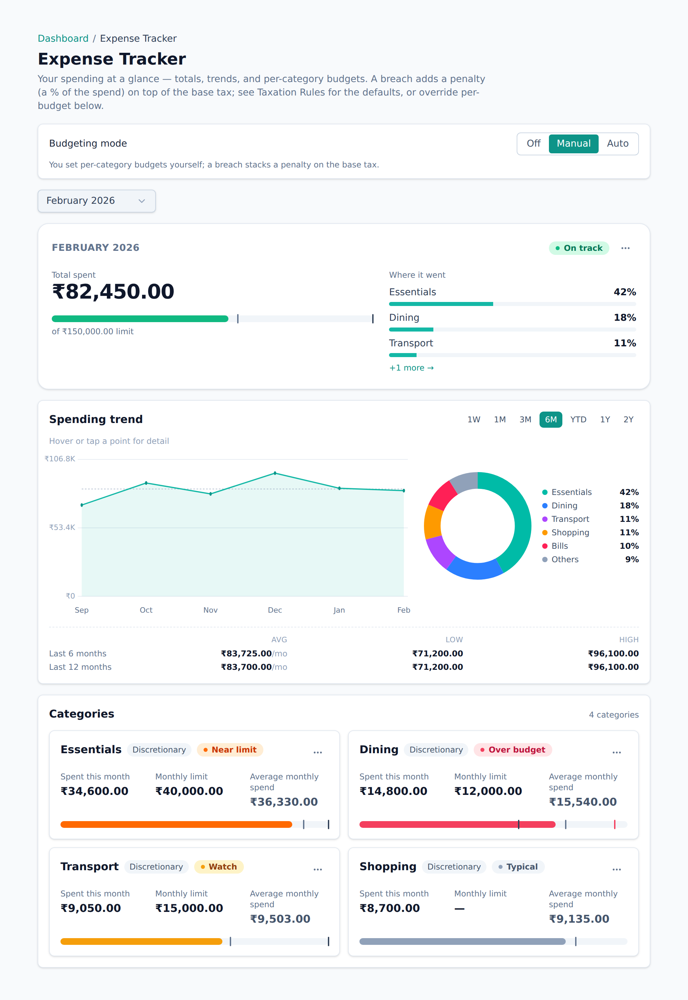
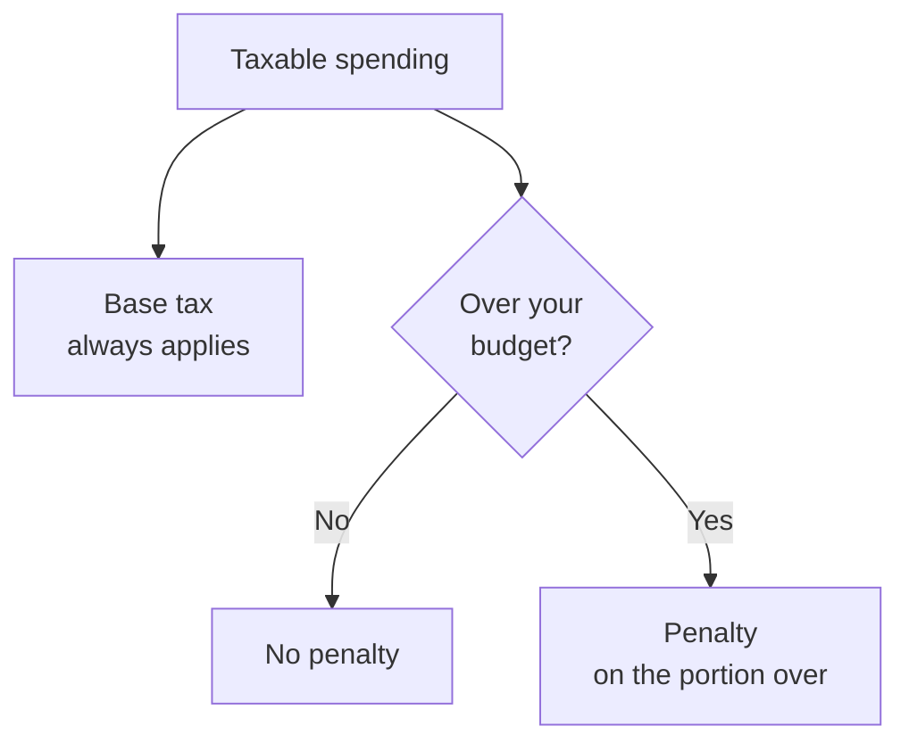

<!-- Tier: T0 · product · users. Assembled at aevum-finance by merging the backend + frontend
     lane T1 docs into one product narrative. The prose here is authored; the provenance block
     below is generated (tooling/build-public.mjs). Keep this page free of tier labels and
     internal paths — a reader must never be shown which module or bucket its content came from. -->

<!-- BEGIN GENERATED:provenance -->
<!-- Product topic "Budgets". Reconciles these mirrored lane T1 docs
     (edit at source; reconcile the merge here):
     backend:  budgets (per-category limits (off/manual/auto) + the spend trackers) -> ../internal/backend/public/budgets.md
     frontend:  budgets (spending limits and the expense tracker) -> ../internal/frontend/public/budgets.md -->
<!-- END GENERATED:provenance -->

# Budgets

A budget in Aevum is a simple promise you make to yourself: _I'll keep my spending on this category, this month, under this amount._ Budgets are how you tell Aevum what "too much" means for **you**.

You set one limit per category — dining out, groceries, shopping, whatever you track — and Aevum keeps a running total of what you've spent against it, so you always know how much room is left before the month is out.

## Where budgets live

Everything happens on the **Expense Tracker**, a single month-scoped page that brings three things together: what you've spent in each category, the limit you've set for it, and how you're tracking against that limit. The page reads top to bottom, most important first:

- **The top** shows this month's total spend, how it compares to last month, and the categories you spent the most on.
- **The middle** is a spending trend — pick a range (a week, a few months, a couple of years) and see the shape of your spending, broken down by which categories made it up.
- **The bottom** is one card per category: what you've spent, your limit if you set one, and a plain signal telling you whether you're on track or over.

A month picker at the top anchors the whole page, so you can look back at any past month the same way you look at this one.

<picture>
  <source media="(prefers-color-scheme: dark)" srcset="images/screenshots/expense-tracker-dark.png">
  
</picture>

## Setting a budget

Open any category card and enter a **monthly limit**. You can also set a **penalty rate** — how much extra a breach of that budget costs (more on that below). If you're budgeting a category you already spend in, Aevum suggests a sensible starting number from your recent spending, so you're not staring at a blank field.

Each card carries a simple signal so you always know where you stand:

| Signal          | What it means                |
| --------------- | ---------------------------- |
| **On track**    | comfortably under your limit |
| **Watch**       | past the halfway mark        |
| **Near limit**  | close to going over          |
| **Over budget** | you've crossed the limit     |

Categories where you haven't set a limit still get a read — measured against your own typical spending, they show as **below typical**, **typical**, **above typical**, or your **most expensive yet** — so the page is useful even before you budget anything.

## What going over does

A budget doesn't cost you anything on its own. What it does is change how the self-imposed [consumption tax](consumption-tax.md) treats your spending. Stay under the limit and you pay only the ordinary base tax — the same small set-aside that applies to everything taxable. Go over, and Aevum adds a **penalty** on top — but only for the spending past the line:

- Spend up to your limit → base tax only.
- The transaction that tips you over, and everything after it that period → base tax **plus** a penalty.

This is the part most people get backwards, so it's worth being explicit:

The **base tax** applies to all taxable spending, all the time — with or without a budget. The **penalty** only ever comes from crossing a limit you set, and it's added _on top_ of the base tax, never instead of it. Setting a budget doesn't create the tax; it only decides whether a penalty gets added. You set the penalty rates yourself, with defaults around 20% for essential categories and 50% for discretionary ones.

The extra shows up in your weekly bill, with a breakdown of exactly which budget you breached — so you can always trace a penalty back to the spending that caused it, and Aevum notifies you the moment you cross a line, so a penalty is never a surprise.

## Refunds count in your favour

Aevum measures a category by your _net_ spending — money out, minus money back. A refund lowers your total for the month and can bring you back under a limit you'd crossed, easing off the penalty again. You're judged on what you actually kept spending, not on a number that only ever goes up.

## Let Aevum do the budgeting

You don't have to pick every number by hand. Budgeting has three modes:

- **Off** — no limits, no breaches, no penalties. Any limits you've set are kept, just ignored, so you can switch back later without losing them.
- **Manual** — you set each category's limit yourself. This is the default.
- **Automatic** — Aevum sets a sensible limit for each category from your recent spending and adjusts it over time: the limit eases up where you consistently spend more, and the penalty softens after a clean month or firms up after one you overran.

Whatever Aevum sets automatically is yours to override. The moment you edit an automatic limit, it becomes yours to keep, while the rest keep updating.

## A budget is fixed for its month

Once a month is under way, its limit doesn't move — not even in automatic mode, where new limits are always drawn from _completed_ months, never the one you're still living in. A goalpost that shifted every time you spent wouldn't be a budget at all. Next month, the automatic limits catch up to your latest habits.

Through all of it, one thing stays constant: turning budgeting off changes only the penalty. The base consumption tax on your spending is separate and stays exactly as it is in every mode.

## FAQ

**Is a budget required?**
No. Without one, spending in that category is simply taxed at the base rate. Budgets are opt-in limits that add the penalty layer on top.

**Does the penalty apply to the whole month's spending?**
No — only from the point you cross the limit onward, never retroactively to everything you spent that period.

**Can different categories have different limits and penalties?**
Yes. Budgets are per category, and you set the penalty rate per category too.
