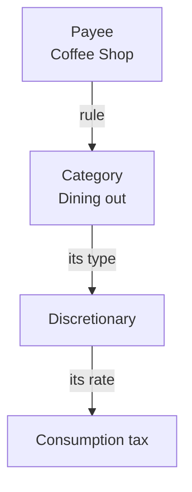

<!-- Tier: T0 · product · users. Assembled at aevum-hub by merging the backend + frontend
     lane T1 docs into one product narrative. The prose here is authored; the provenance block
     below is generated (tooling/build-public.mjs). Keep this page free of tier labels and
     internal paths — a reader must never be shown which module or bucket its content came from. -->

<!-- BEGIN GENERATED:provenance -->
<!-- Product topic "Categories & rules". Reconciles these mirrored lane T1 docs
     (edit at source; reconcile the merge here):
     backend:  categorization (assigning tags to transactions via rules) -> ../internal/backend/public/categorization.md
              tags (the hierarchical category tree and tag types) -> ../internal/backend/public/tags.md
     frontend:  categorization (the auto-tagging rules surface) -> ../internal/frontend/public/categorization.md
              tags (the category tree that sets each transaction's tax treatment) -> ../internal/frontend/public/tags.md -->
<!-- END GENERATED:provenance -->

# Categories & rules

Every expense in Aevum is filed under a **category** — Groceries, Rent, Dining out, and so on. Categories are how the app understands your money; they're the reason it can do anything smarter than list your transactions back to you. And because a category carries a tax **type**, sorting your spending is also what sets up your [consumption tax](consumption-tax.md), your [budgets](budgets.md), and your reports. This page covers how categories work and how to put the sorting on autopilot.

## Categories are a tree

Categories nest inside each other like folders. _Groceries_ and _Dining out_ can both sit under _Food_; _Rent_ and _Electricity_ under _Household_. When you file an expense under a specific category, it counts toward the broader ones above it too — automatically, all the way up the chain.

That's what lets you zoom in and out. Track _Food_ as one number, or split it into _Groceries_, _Dining out_ and _Coffee_ — whatever matches how you actually think about money — without ever tagging a transaction twice.

## Every category has a type — and the type sets the tax

This is the part that makes categories more than labels. Each one carries a **type** that tells Aevum how to treat spending filed under it:

- **Discretionary** — dining, shopping, treats. Taxed the most.
- **Essential** — groceries, utilities, transport. Taxed lightly.
- **Fixed commitments** — rent, loan EMIs. Effectively untaxed until you raise the rate yourself.
- **Exempt** — savings and giving, left out of the tax entirely.
- **Income and transfers** — money coming in, or moving between your own accounts. Never taxed.

You never set a tax rate on an individual purchase. You set the type of the category **once**, and every expense filed under it is treated consistently. A discretionary treat is nudged harder than a genuine essential; the exact rate for each type is yours to tune under **Settings → Taxation rules**. See [the consumption tax](consumption-tax.md) for what each type means and how the weekly bill is built.

## Rules put the sorting on autopilot

Sorting every transaction by hand is the chore that kills most budgeting apps. Aevum's answer: **tell it once, and it remembers.**

A **rule** links a [payee](beneficiaries.md) — a shop, a person, your employer — to one or more categories: _"whenever I pay this coffee shop, tag it as Dining out."_ Once that rule exists, every future payment to that payee is tagged the moment it appears, whether you typed it in yourself or it arrived in an imported bank statement. You do the thinking once; Aevum does the filing forever.

When a rule carries more than one category, the **first** one leads — that's the label Aevum treats as the headline, and it's what decides the tax.

<picture>
  <source media="(prefers-color-scheme: dark)" srcset="images/screenshots/categorization-rules-dark.png">
  
</picture>

## The same payee, more than one story

Real life isn't tidy. A single company might be a shop you _buy_ from **and** your employer. Money coming in from the employer side is salary; a refund coming back from the shop side is something else entirely.

So a payee can carry more than one rule, tuned by direction:

- A **default** rule that covers everything unless you say otherwise.
- An override for **money going out**.
- An override for **money coming in**.

Most payees only ever need the default, and that's all you'll see for them. The extra lanes are there for the few that need to tell two stories, and Aevum only shows the finer breakdown when a payee actually has one.

## Correcting and re-running

You're always in charge, and your manual choices always win:

- **Your hand-picked categories are never overwritten.** Change a rule later and it won't touch anything you sorted yourself.
- **Edit a rule and Aevum re-tags** the transactions it affects; the totals that depend on them update to match.
- **Re-run categorization** walks back over your existing transactions and re-files them against your current rules — handy after a cleanup, or once you've taught Aevum something it didn't know before.

## Setting a rule without leaving your flow

You don't have to visit the rules page first. While [adding a transaction](transactions.md):

- Picking a payee that already has a rule **auto-fills** its categories.
- If you change them, Aevum shows you exactly what's different and asks whether to apply it **just this once** or **update the rule**.
- Choose to save the rule and Aevum keeps your transaction, then drops you on the rules page with everything pre-filled — so you finish where rules live, nothing lost. You can even create a brand-new payee on the spot from the search box.

## When Aevum isn't sure

If a transaction is with someone you've never set a rule for, Aevum doesn't guess wildly. Money you **spent** is filed as miscellaneous spending, so it still counts toward your budgets and tax rather than vanishing. Money you **received** is set aside as unsorted — Aevum won't assume it's income, because guessing wrong there would quietly distort your finances. Nothing is ever dropped or silently mislabelled; step in and categorize it whenever you like.

## Managing your categories

You'll find everything under **Settings → Categories**. From there you can add a category and place it anywhere in the tree, rename or re-type an existing one, delete a category or a whole branch (you'll be asked to confirm), and give a category **aliases** — alternative names, so Aevum still recognises it when a merchant writes it differently in an imported statement.

A few categories are built in and looked after by Aevum itself — a running **Total**, the catch-alls that hold spending and receipts it couldn't sort, and the one the tax itself uses. These are locked so the app's own bookkeeping stays sound; you'll see them in the tree without edit or delete buttons, and they're never offered when you build a rule. The starter categories Aevum ships with can't be renamed or moved either — but you **can** still change their type and give them aliases, so you can tune how they behave without disturbing the defaults everyone starts from.

## FAQ

**What's the difference between a category and a rule?**
A category is a label with a tax type. A rule is an automatic instruction — "give this payee these categories." Categories describe; rules automate.

**Will changing a category's name change how old spending was taxed?**
No. It's the category's _type_, not its name, that does the work — so renaming or reorganizing never disturbs how anything was taxed before.

**What if a transaction has no matching rule?**
It's filed as miscellaneous (and taxed at the standard rate) until you categorize it or add a rule. Your choice always wins over any rule.
