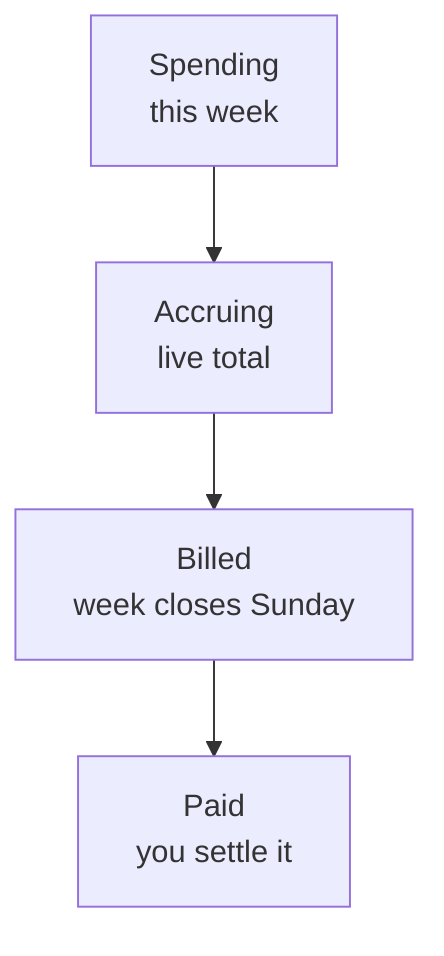
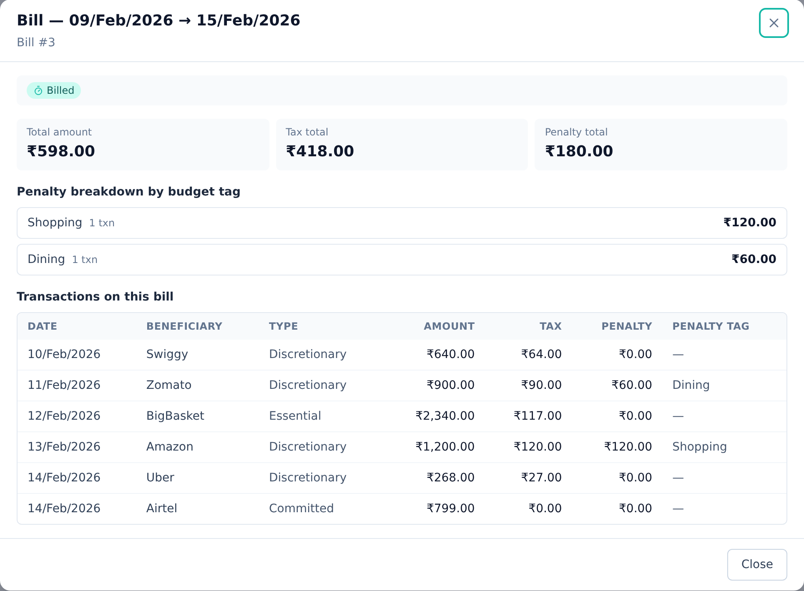
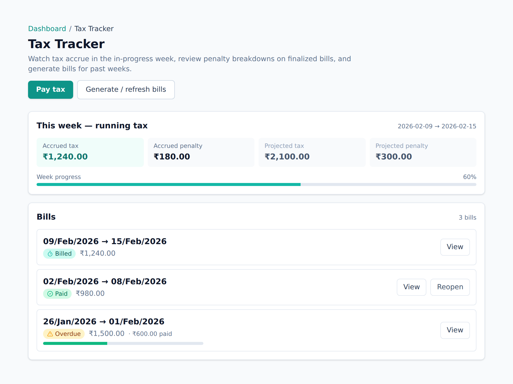

<!-- Tier: T0 · product · users. Assembled at aevum-finance by merging the backend + frontend
     lane T1 docs into one product narrative. The prose here is authored; the provenance block
     below is generated (tooling/build-public.mjs). Keep this page free of tier labels and
     internal paths — a reader must never be shown which module or bucket its content came from. -->

<!-- BEGIN GENERATED:provenance -->
<!-- Product topic "The consumption tax & your weekly bill". Reconciles these mirrored lane T1 docs
     (edit at source; reconcile the merge here):
     backend:  taxation (the real-time consumption-tax ledger and weekly bills) -> ../internal/backend/public/taxation.md
     frontend:  taxation (the Tax Tracker surface) -> ../internal/frontend/public/taxation.md -->
<!-- END GENERATED:provenance -->

# The consumption tax & your weekly bill

This is the idea at the heart of Aevum. It's worth five minutes.

## Why a "tax" on your own spending?

Most budgeting apps just _tell you_ what you spent. Aevum turns each expense into a
small act of saving. Every time you spend on something taxable, a fraction of it is
set aside as a **self-imposed consumption tax** — money you're quietly provisioning
for future expenses of the same kind.

The point is **forced provisioning, not punishment.** The tax isn't a scolding for
spending; it's a way of funding the next time you need to spend on that thing. And the
money is real: it's moved into your [savings account](savings-account.md), not just
tallied on a screen.

## How much is taxed

Every expense is sorted into a **type**, and each type carries its own rate — which
**you** control:

| Type of spending      | Examples                            | Default rate |
| --------------------- | ----------------------------------- | ------------ |
| **Discretionary**     | dining out, shopping, entertainment | 10%          |
| **Essential**         | groceries, utilities, transport     | 5%           |
| **Fixed commitments** | rent, loan EMIs                     | 0%           |
| **Uncategorized**     | anything not yet sorted             | 10%          |

The more optional the spend, the bigger the provision it builds — so discretionary is
taxed more than essential. Fixed commitments sit at 0% by default on purpose: they
count as taxable but start un-taxed, so you can raise the rate yourself if you'd like
to provision for them too.

> Income, transfers between your own accounts, and the tax payments themselves are
> never taxed. Anything you mark **exempt** is left alone as well.

## Budgets add a penalty — the tax alone does not

This is the part most people get backwards, so it's worth being explicit: **the base
tax above applies to all taxable spending, all the time** — whether or not you're over
budget.

Separately, you can set a [budget](budgets.md) per category. Stay inside it and you pay
only the base tax. **Overspend it** and Aevum adds a **penalty** on top, for the portion
that crossed the line — a sharper nudge. Default penalties are around 20% for essential
categories and 50% for discretionary ones, and they're adjustable too.

So there are two distinct things happening:

1. **Base tax** — always, on every taxable expense → builds your savings.
2. **Penalty** — only when you bust a budget → an extra cost for going over.

A refund works in your favour: it reduces your spending for the period, and can bring
you back under a limit you'd crossed.

## The weekly bill

Rather than nickel-and-diming every purchase, Aevum totals your tax (plus any
penalties) over a week into a **single bill**. Weeks run **Monday to Sunday** in your
timezone.

During the week the bill is **live** — it grows as you spend, so you watch it in real
time instead of being surprised. When the week closes it's **billed** (locked in), and
you have two weeks to settle it. Settling moves the money out of your everyday account
and into your savings account.

If a bill goes unsettled past its grace period it's flagged **overdue**, and a bill
left unpaid long enough may **expire**. In normal use, though, you'll just watch bills
accrue, finalize each week, and get paid.

<picture>
  <source media="(prefers-color-scheme: dark)" srcset="images/screenshots/weekly-bill-dark.png">
  
</picture>

## Watching and paying it

The **Tax Tracker** is where all of this lives. The top shows the week you're in — how
much you've accrued so far, and how much of that is penalty — updating as you spend.
Below it is the list of past bills, each showing its status (accruing · billed · paid ·
overdue · expired) at a glance.

Open any bill and you see exactly what made it up: every transaction that contributed,
what it was taxed at, and — if you went over a budget — the penalty broken down by
which budget you breached. A bill is never just a number you're asked to accept; you
can always trace it back to the spending that produced it.

A single **Pay tax** action settles what you owe in one go. You can also mark
individual bills as paid if you settled them another way — and if you simply transfer
money into your savings account yourself, Aevum recognises it and applies it to your
oldest outstanding bills automatically, so paying "by hand" still keeps the ledger
straight.

<picture>
  <source media="(prefers-color-scheme: dark)" srcset="images/screenshots/tax-tracker-dark.png">
  
</picture>

## Corrections don't rewrite history

Once a week has closed, its bill is never rewritten. If you later correct a transaction
from that week, the difference appears as a clearly-labelled adjustment on your
_current_ bill instead — with a before-and-after — so your history stays trustworthy
and you can always see what changed and why.

## Prefer to skip the tax? It's optional

Aevum's automatic **tax mode** runs the weekly cycle for you — finalizing each week's
bill and, if you like, settling it automatically. You don't have to use it:

- **Turn it off** to run in manual mode. Your tax then stays a running tally and never
  comes due unless you choose to generate a bill — so you can use Aevum as a
  straightforward spending tracker, with categories, budgets, and reports, without the
  tax driving anything.
- **It can switch itself off, too.** If unpaid bills pile up past a safe limit, Aevum
  turns tax mode off, clears the stale backlog, and notifies you — so a forgotten bill
  never quietly snowballs. Turn it back on whenever you're ready.

## Setting your rates

Under **Settings → Taxation rules** you control the whole thing: the tax rate for each
kind of spending and the penalty rate for going over budget. Each rule comes with a
plain-language explanation of what that kind of spending covers, so you're not guessing
what "discretionary" means when you change a number. Enter a rate however you think
about it — `5%`, `0.05`, or just `5`.

## FAQ

**Is this a real / government tax?**
No. It's entirely self-imposed — a personal accountability and savings tool. You set
the rates, and the money goes to your own savings account.

**Can I turn the tax off for something?**
Mark it as exempted, or categorize it as a fixed commitment — neither is taxed by
default.

**I edited an old transaction. Does my old bill change?**
Finalized bills aren't rewritten. Aevum posts the difference as a small adjustment to
your current week, so history stays accurate without being re-litigated.

**Where can I change the rates?**
Settings → Taxation rules. There's one rate per spending type, and you can tune both
the base tax and the breach penalty.
