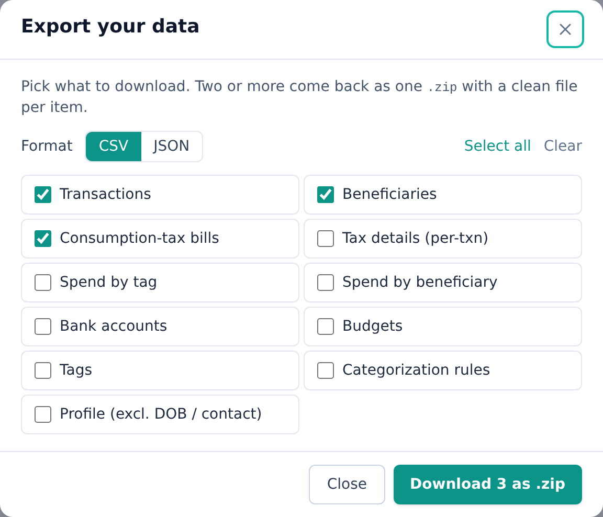
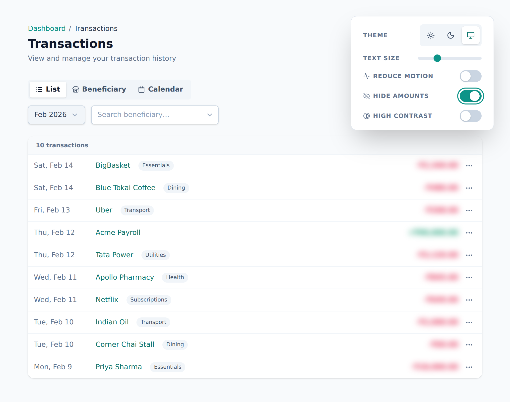

<!-- Tier: T0 · product · users. Assembled at aevum-hub by merging the backend + frontend
     lane T1 docs into one product narrative. The prose here is authored; the provenance block
     below is generated (tooling/build-public.mjs). Keep this page free of tier labels and
     internal paths — a reader must never be shown which module or bucket its content came from. -->

<!-- BEGIN GENERATED:provenance -->
<!-- Product topic "Your data & privacy". Reconciles these mirrored lane T1 docs
     (edit at source; reconcile the merge here):
     backend:  exports (per-domain CSV/JSON data export) -> ../internal/backend/public/exports.md -->
<!-- END GENERATED:provenance -->

# Your data & privacy

Aevum holds a detailed picture of your finances, so you should know exactly what you can do with that data — and what happens to it when you leave. This page lays it out plainly. The controls here are all about your data; the sign-in and identity side of your account lives on [account & security](account-and-security.md).

## Aevum never connects to your bank

There is no "connect your bank" step. Aevum never asks for your banking login,
stores no bank password, and has no third-party account-aggregator link — not
even a read-only one.

Your transactions get in one of exactly two ways, and you control both:

- **You enter them yourself**, a few fields at a time.
- **You upload a statement** — a PDF or CSV you have already downloaded from your
  bank or UPI app. Aevum reads that file. It never reaches out to fetch anything
  on your behalf.

The one bank-adjacent detail Aevum stores is your **UPI ID** (something like
`you@bank`), and only so imported rows land against the right account. A UPI ID
is a public address — the same string you hand out in order to _receive_ money.
It is not a credential, and it cannot be used to take money out.

The consequence is the part worth understanding: **Aevum cannot move your money.**
When you settle a weekly bill, you make that transfer yourself, in your own
banking or UPI app — Aevum records that it happened and updates your balances.
Everything it shows you is bookkeeping over transfers you made. See
[your savings account](savings-account.md) for how settling works.

## Your data is yours

Everything you put into Aevum — every transaction, every tax bill, your budgets, your categories, your payees — belongs to you. Whenever you want, you can download a copy, hide it on screen, delete parts of it, or close your account entirely. No request, no waiting, no locked doors.

## Export your data

Whenever you want a copy of what's in Aevum, you can take one — the full ledger or just the parts you need. You can export:

- **Your transactions** — the complete ledger, with who each was with, which account it touched, how it was categorized, and any notes you added.
- **Your weekly tax bills** — both the bill totals and the line-by-line detail behind each one, so you can see exactly how a number was reached.
- **Your spending summaries** — how your spending rolls up by category and by payee, week over week and month over month.
- **Your setup** — your budgets, your categories, and the [rules](categories-and-rules.md) that auto-sort your spending, so a backup captures how Aevum is tuned for you, not just what it recorded.
- **Your accounts and payees**, plus a short profile summary.

### CSV or JSON — your choice

- **CSV** opens straight in any spreadsheet — Excel, Google Sheets, Numbers. Best if you want to sort, chart, or just eyeball your numbers.
- **JSON** is the tidy, structured form — best if you're feeding your data into another tool or keeping a faithful backup.

Download one kind of record at a time, or bundle several together into a single zip file in one go.

Two things make an export genuinely yours to keep. It's **readable, not cryptic**: wherever a record points at something else — a payee, an account, a category — the file spells out the _name_, not an internal code, so you never need Aevum open to make sense of your own data. And it's **joinable**: related exports share a common reference, so your transactions and the tax detail behind them still line up after you've downloaded them. Your export is also **private by default** — the details you'd never want loose in a spreadsheet, like your date of birth and contact details, stay behind.

<picture>
  <source media="(prefers-color-scheme: dark)" srcset="images/screenshots/privacy-export-dark.png">
  
</picture>

## Mask amounts on screen

Turn on **amount masking** to blur every monetary value in the app — handy when you're on a train, sharing your screen, or simply don't want your balances visible at a glance. Masked amounts reveal when you hover or focus on them, so you can still check a figure when you need to without unmasking everything. This is purely a display setting: your data is unchanged, and masking hides amounts from the screen, not from Aevum itself.

<picture>
  <source media="(prefers-color-scheme: dark)" srcset="images/screenshots/privacy-mask-dark.png">
  
</picture>

## Delete individual things

You don't have to wipe everything to remove one thing. You can delete a single [transaction](transactions.md), a [beneficiary](beneficiaries.md), an account's details, or other individual records directly — useful for cleaning up a mistaken entry or removing something you'd rather not keep.

## Reset all your data

A **data reset** is a clean restart: it clears every piece of financial data you own — transactions, bills, budgets, categories, [recurring](recurring.md) forecasts — while keeping your **account itself** (your login, profile, and preferences) intact. Think of it as emptying the app back to day one without having to sign up again.

> A reset is irreversible, so take an export first if you want a copy. If you only want to step away, you don't need to reset — your data simply waits for you.

## Delete your account

You can close your account entirely. Deletion has a **grace period**: you're signed out immediately and emailed a link to undo it, so you can change your mind within the window before anything is permanently removed. Your sign-in and identity settings live on [account & security](account-and-security.md), but the deletion itself — and what's kept afterwards — is a data question, covered here.

## What Aevum keeps after you leave — and why

Closing your account removes your personal data, with one deliberate, narrow exception worth knowing about.

Because Aevum's [consumption tax](consumption-tax.md) corresponds to **real money you actually set aside**, your tax and bill records aren't purely cosmetic — they reflect genuine financial activity the app guided. For legal and regulatory compliance, a minimal record is kept after deletion:

- **Bill-level tax records** — the books of what was billed, the way a ledger outlives any one member.
- **An overall spend rollup** — a single high-level total, with **no per-category detail**.
- **Your email address** — kept only for authorized future correspondence.

Everything else that identifies you is dropped. This is the narrow exception to "delete means gone," and it exists specifically because the data maps to real-world transactions — not to keep tabs on you.

## FAQ

**Do I have to connect my bank account?**
No — and you can't, because Aevum has no way to. You enter transactions yourself
or upload a statement you already downloaded. The only bank-adjacent thing it
stores is your UPI ID, which is a public address, not a credential.

**Can Aevum take money out of my account?**
No. It has no access and no payment authority. Settling a bill means _you_ make
the transfer; Aevum records it.

**Can I get all my data out before I leave?**
Yes — export to CSV or JSON first, then reset or delete. Your export is a full copy you keep.

**Does masking amounts hide them from Aevum, or just from the screen?**
Just from the screen — it's a display setting for privacy in public or shared situations. Your data is unchanged; hover or focus to peek at a value.

**If I reset my data, do I lose my account?**
No. A reset clears your financial data but keeps your account, profile, and preferences. To remove the account itself, use account deletion.

**Why is anything kept after I delete my account?**
Only the minimum required for compliance, because your tax bills reflect real money set aside. It's a small, fixed record — billing totals plus your email — not your full history.
