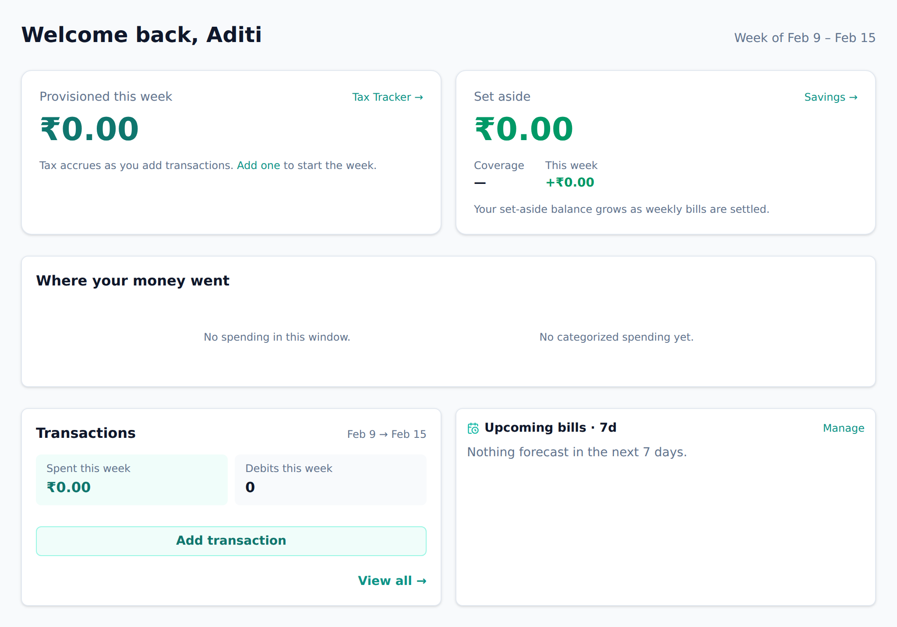

<!-- Tier: T0 · product · users. Assembled at aevum-hub by merging the backend + frontend
     lane T1 docs into one product narrative. The prose here is authored; the provenance block
     below is generated (tooling/build-public.mjs). Keep this page free of tier labels and
     internal paths — a reader must never be shown which module or bucket its content came from. -->

<!-- BEGIN GENERATED:provenance -->
<!-- Product topic "Getting started". Reconciles these mirrored lane T1 docs
     (edit at source; reconcile the merge here):
     backend:  onboarding (post-registration setup + the sample-data demo) -> ../internal/backend/public/onboarding.md
     frontend:  onboarding (the guided setup, sample-data demo, and product tour) -> ../internal/frontend/public/onboarding.md
              dashboard (the authenticated home — a glance over every feature) -> ../internal/frontend/public/dashboard.md -->
<!-- END GENERATED:provenance -->

# Getting started

Welcome to Aevum. This page takes you from a fresh account to the point where the app is quietly working on your behalf — and shows you how to explore it fully before you commit a single real number.

## Your first few minutes

Signing up needs nothing more than an email and a password. You're in straight away; you can fill in the rest of your profile whenever you like. Once you confirm your email, a quick setup opens on its own and walks you through three small things:

- **Your name** — so Aevum can greet you.
- **Securing your account** — set up account recovery and, if you like, two-step sign-in. Optional, and covered in [account & security](account-and-security.md).
- **Region & currency** — confirm where you are and the currency you think in. Your currency is chosen from your country, so amounts show up the way you expect from the start.

You can move through it a step at a time, skip any optional step, or close it entirely and head straight to your dashboard. It only ever nudges you **once** — close it and come back tomorrow and it won't pop up again. It's a helping hand, not a gate. Confirming your email is also the moment Aevum sends your welcome note and greets you by name.

## Your home screen

After signing in you land on your **dashboard** — your home in Aevum, a single glance that answers the questions you actually open a finance app to ask: where do I stand, what needs me, how am I trending, and what's coming up.

The headline greets you and shows the week you're in, then leads with the number that matters most to how you use Aevum. If you're using it as a self-tax tool, you'll see how much you've set aside this week beside how much you've actually saved toward it; if you've turned the tax off and are using Aevum as a plain expense tracker, the same spot leads with this month's spending and how much budget room is left. Either way it's a live number — it moves as you spend.

Below that, Aevum surfaces anything that genuinely needs you: an overdue bill, a budget you've gone over, or a setup step you haven't finished. When there's nothing to act on, that space simply isn't there — seeing nothing means you're clear. Further down sit your spending trends, your most recent transactions, and the bills coming due in the next week. Nothing here is a dead end: every part of the page links straight through to the fuller feature behind it.

<picture>
  <source media="(prefers-color-scheme: dark)" srcset="images/screenshots/dashboard-initial-dark.png">
  
</picture>

## See Aevum with real data first

An empty budgeting app is hard to judge. The whole point of Aevum is the picture that appears _after_ your spending is in it — the weekly tax, the budgets, the savings building up. So before you add anything of your own, you can fill Aevum with **realistic sample data** and click around freely.

This isn't a mock-up bolted on the side. The sample transactions run through exactly the same machinery your real spending would — so the categories, the weekly tax bills, and the savings all behave the way they will once your own data lands. The sample world spans about three months of everyday life — salary coming in, groceries and fuel and dining out going back out, a few subscriptions and EMIs — and it's always kept current, so the most recent activity lands on today rather than looking months old.

While sample data is active, a gentle banner reminds you the numbers aren't yours, so you're never confused about what you're looking at. When you're ready to begin for real, clearing it out takes a single step — no password, no ceremony, because there's nothing of yours to protect yet. The one exception: if you've already started adding your own transactions on top of the sample set, Aevum asks you to confirm properly first, so real data is never lost by accident. Clearing the sample data clears only the data — where you are in your setup journey stays exactly as it was.

## Finding your feet

A short **Getting Started** checklist points you at the first real steps: **add an account**, **import a statement**, **take the tour**, and **try sample data**. It watches what you actually do — add an account and that item quietly checks itself off, with no separate "mark as done" busywork. You can reach it any time from the **Help** page, so there's no rush to finish in one sitting.

If you'd rather be shown around, the **guided tour** is a short, narrated walk through the life of a transaction — from your dashboard, through your spending and budgets, to the tax tracker and back. It highlights one thing at a time, and if you stop partway, Aevum remembers where you were.

## Add your first transaction

When you're ready for the real thing, adding a transaction takes just a few fields — [who](beneficiaries.md) it was with, how much, whether it's money out or in, and the date. If you've set a [rule](categories-and-rules.md) for that beneficiary before, Aevum fills in the categories for you. Don't want to type everything? Import a statement instead and Aevum reads the transactions for you.

That single transaction is enough for Aevum to start working: it categorizes it, sets aside any [consumption tax](consumption-tax.md), and folds it into this week's bill. From there, set a [budget](budgets.md) or two, watch your [savings account](savings-account.md) grow, and the same picture you just explored starts filling in with your own life.
