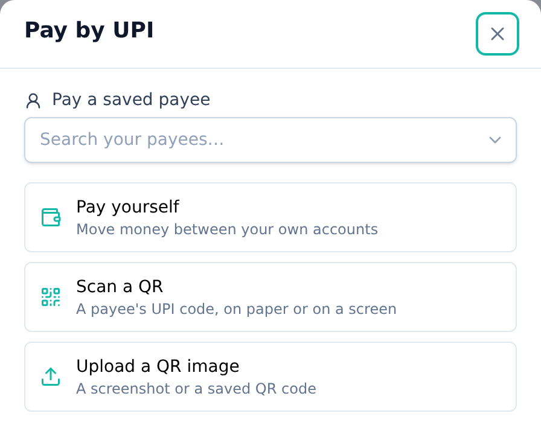
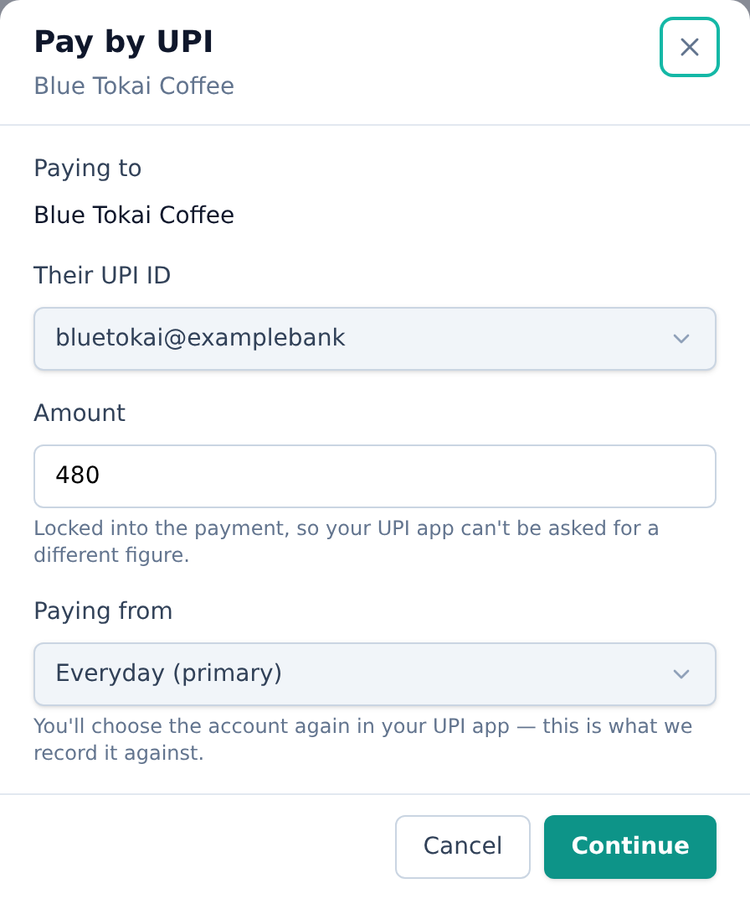
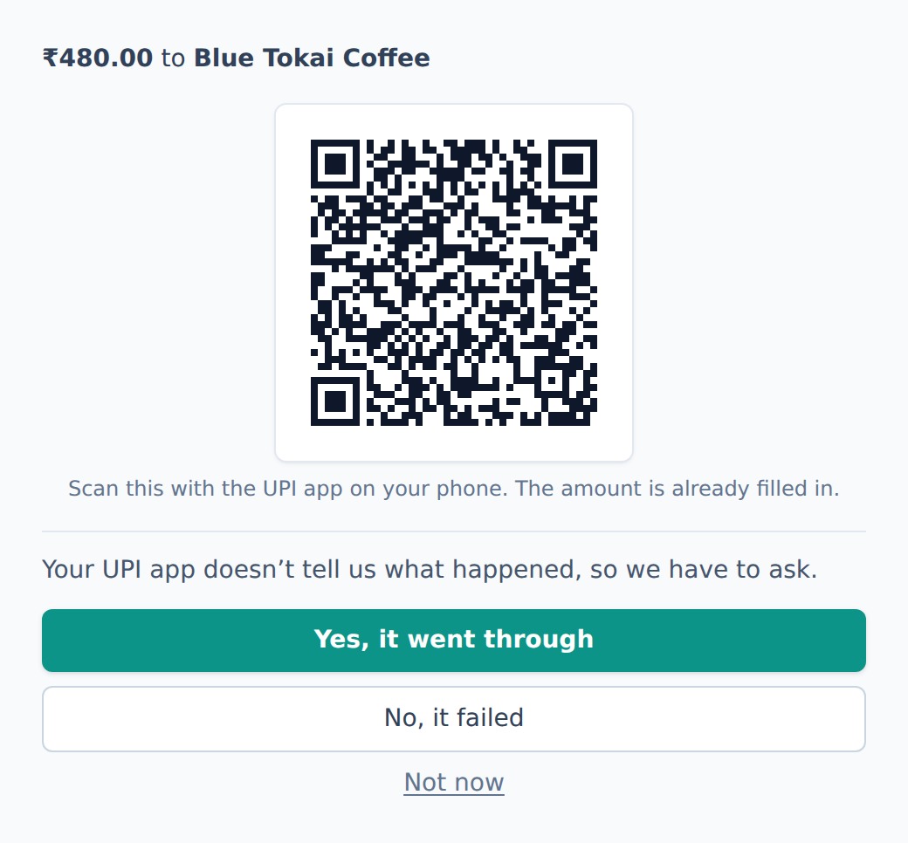
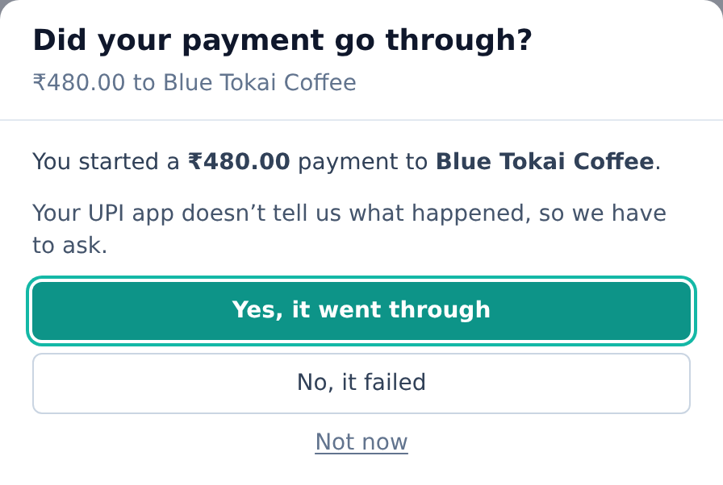

<!-- Tier: T0 · product · users. Assembled at aevum-finance by merging the backend + frontend
     lane T1 docs into one product narrative. The prose here is authored; the provenance block
     below is generated (tooling/build-public.mjs). Keep this page free of tier labels and
     internal paths — a reader must never be shown which module or bucket its content came from. -->

<!-- BEGIN GENERATED:provenance -->
<!-- Product topic "Paying by UPI". Reconciles these mirrored lane T1 docs
     (edit at source; reconcile the merge here):
     frontend:  payments (the UPI initiate-and-record rail — payload, handoff, confirm-on-return) -> ../internal/frontend/public/payments.md -->
<!-- END GENERATED:provenance -->

# Paying by UPI

Every other part of Aevum asks you to tell it what you spent, after you spent it. This one doesn't. You start the payment here, approve it in your own UPI app, and it's on your books the moment it's done — no typing it in afterwards, no waiting for it to surface on a statement.

## What Aevum does, and what it doesn't

Aevum prepares the payment — who it's going to, how much, and a reference of its own — and hands that to **your** UPI app. You approve it there, with your own PIN, exactly as you always have.

**Your money never passes through Aevum.** It goes straight from your bank to the payee, the same as if you'd scanned the code yourself. Aevum is not a payment app and never holds a rupee of yours; it prepares, and it records, and that's the whole of it.

## Who are you paying?

That's the only question **Pay** asks to begin with. It sits on your dashboard and on your [transactions](transactions.md) page, and on a phone there's a Pay button waiting at the bottom of every screen.

- **Someone you've paid before** — pick them from the list. Their UPI ID is already filled in.
- **A QR code** — scan it with your camera, or upload a picture of one. Both work on a phone and on a computer, because the code is as likely to be on a screen in front of you as printed on a counter. In a dim restaurant, there's a flashlight.
- **Yourself** — move money between your own accounts. Aevum knows that isn't spending, so it isn't taxed as any.
- **Your weekly bill** — settle your [self-tax](consumption-tax.md) into your [savings account](savings-account.md), from the tax page or from inside any unpaid bill.

<picture>
  <source media="(prefers-color-scheme: dark)" srcset="images/screenshots/pay-chooser-dark.png">
  
</picture>

**You're never asked to type a UPI ID out of thin air.** It's long, it's easy to mistype, and a wrong one pays a stranger with no way back — so it comes from somewhere trustworthy: someone on file, or a code you scanned. You _can_ type one, for a handle a friend texted you. It's just never the thing Aevum leads with.

## It remembers who you pay

Scan a code from a shop you've used before and Aevum recognizes them. You see their name — not a string of characters you'd have to read carefully to be sure about. If they have more than one UPI ID, the others are there too; a shop's counter code and its refund code aren't interchangeable, and neither are a company's payroll account and its billing one.

Someone new is filled in from the code and saved once the payment goes through, so next time they're already known. The name is yours to correct before you pay — and if the code carries nothing but a phone number, Aevum leaves the name blank rather than filing them under a row of digits you'd never find again.

Everything you'd expect follows from that: the payment is [categorized](categories-and-rules.md) like any other, counted against your [budgets](budgets.md), and taxed at the rate for what it was.

## Filling in the payment

You'll be asked for the amount and shown which of your accounts you're paying from. Two things worth knowing:

- **The amount is locked into the payment.** Your UPI app shows it already filled in, so there's no chance of a stray digit between here and there. If you're scanning a code that already carries an amount, that amount is fixed by the payee and can't be changed — pay it or cancel.
- **The account you pick is a note for your own records.** UPI doesn't let an app choose which of your accounts pays; you'll select that inside your UPI app, and you're free to pick a different one. Aevum records what you told it, and your statement settles the matter later.

<picture>
  <source media="(prefers-color-scheme: dark)" srcset="images/screenshots/pay-form-dark.png">
  
</picture>

On a phone you'll get a button that opens your UPI app. On a computer you'll get a QR code instead, because your UPI app is on the phone in your hand — scan it there.

<picture>
  <source media="(prefers-color-scheme: dark)" srcset="images/screenshots/pay-handoff-dark.png">
  
</picture>

## The bit that needs you: "Did it go through?"

When you come back, Aevum asks whether the payment succeeded.

This isn't Aevum being unsure of itself. **A website genuinely cannot be told the outcome of a UPI payment** — there's no channel for it on any phone or browser, and Aevum isn't in the path your money takes, so it has nothing else to go on. The only reliable source is you.

<picture>
  <source media="(prefers-color-scheme: dark)" srcset="images/screenshots/pay-confirm-dark.png">
  
</picture>

You have three answers:

- **Yes, it went through** — recorded as a real transaction, categorized and taxed like any other.
- **No, it failed** — nothing is recorded. A failed payment leaves no phantom spend behind.
- **Not now** — you don't know yet. Maybe you're waiting on your bank's message. The question comes back later; nothing is written either way.

That last one matters. **A guess is worse than a delay** — a wrongly recorded payment distorts your spending, your budgets and your self-tax, and it's more work to unpick than it was to wait.

Answer once and that's the end of it. If you close the tab, switch devices, or simply forget, the question isn't lost — it'll be waiting in your [notifications](notifications.md) next time you're back. And a payment you never answer for is eventually written off rather than left hanging, so it can't quietly become a spend you didn't make.

## Paying a bill Aevum expected

Bills Aevum has learned to expect — the ones on your [recurring](recurring.md) page and in the upcoming widget on your dashboard — have a **Pay** button too. The amount is prefilled from what the bill usually costs, and you can change it if this month is different. Once you confirm, both the transaction and the bill are settled: it moves out of upcoming and into your history there and then.

## Settling your self-tax

The weekly bill Aevum's [consumption tax](consumption-tax.md) rolls up to is settled by moving money into your [savings account](savings-account.md) — and that's a payment like any other, so you can make it here. Aevum prepares a transfer into your savings account's own UPI ID and hands it over; when you confirm, the bill is discharged.

If you'd rather move the money some other way — your banking app, a standing instruction, cash you've already set aside — you still can. Tell Aevum you did, and it records the settlement without pretending it did the moving.
