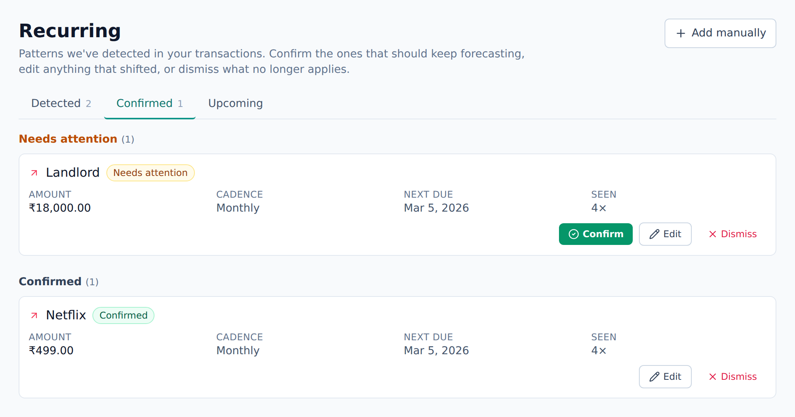

<!-- Tier: T0 · product · users. Assembled at aevum-finance by merging the backend + frontend
     lane T1 docs into one product narrative. The prose here is authored; the provenance block
     below is generated (tooling/build-public.mjs). Keep this page free of tier labels and
     internal paths — a reader must never be shown which module or bucket its content came from. -->

<!-- BEGIN GENERATED:provenance -->
<!-- Product topic "Recurring bills". Reconciles these mirrored lane T1 docs
     (edit at source; reconcile the merge here):
     backend:  recurring (recurring-payment inference and forecast) -> ../internal/backend/public/recurring.md
     frontend:  recurring (spotting and confirming repeating bills) -> ../internal/frontend/public/recurring.md -->
<!-- END GENERATED:provenance -->

# Recurring bills

Some of what you spend is a surprise. A lot of it isn't — rent, a phone bill, a streaming subscription, the same grocery run every payday, a salary landing every month. Aevum learns those repeating expenses from your history and tells you what's coming, so the predictable stuff never catches you out.

You don't have to set any of this up. Aevum simply watches your history and notices the rhythm.

## How Aevum spots a pattern

As you record — or [import](transactions.md) — transactions, Aevum quietly looks for patterns: the same [beneficiary](beneficiaries.md), around the same amount, on a regular beat (weekly, monthly, or yearly). When the same expense turns up on that beat, Aevum recognizes it as a pattern: who it's paid to, roughly how much, and when to expect it next.

It waits until it's actually sure. A single payment isn't a pattern, and neither is two. Once it has seen the same expense repeat enough times to be confident, Aevum surfaces it as something it **detected** — a suggestion, not a decision. Until then it holds the idea quietly in the background rather than bothering you with a guess.

## It stays honest about your money

This is worth being clear about: **Aevum never spends on your behalf and never invents a transaction.** Everything it shows is either something that genuinely happened in your accounts, or a forecast clearly marked as something it _expects_. The real payments always come from you or your bank — Aevum only recognizes them.

So a forecast is a prediction, never a charge. When the real expense happens, Aevum matches it against the forecast and marks it confirmed, so your actuals stay clean and your predictions stay honest. And if a bill Aevum expected never shows up, nothing is created out of thin air — the expectation simply expires, and the miss is flagged rather than silently forgotten.

## Confirming, correcting, dismissing

Detected patterns wait for you on the Recurring page under **Detected**. For each one you can:

- **Confirm** it — you agree this is a real recurring bill, and Aevum should keep an eye out for it going forward.
- **Edit** it — the amount drifted, the day changed, the payee is slightly off. Adjust it and it becomes yours.
- **Dismiss** it — it was a coincidence, or it's over. It moves aside and stops being forecast. If you change your mind, you can bring it back.

Once you confirm one, it moves to **Confirmed**, alongside anything you added yourself.

## Adding one yourself

If there's a regular bill Aevum hasn't spotted yet — maybe it's brand new, or you just started using the app — you can add it by hand with **Add manually**. You pick the payee, the amount, whether it's money going out or coming in, and how often it repeats (weekly on a given day, monthly on a given date, or yearly). From then on it's treated exactly like a confirmed one.

## You stay in control

- **The moment you edit one, it's yours.** Aevum keeps quietly adjusting the patterns it worked out on its own — but as soon as you change one, it stops second-guessing you and leaves that one exactly as you set it.
- **Patterns that stop repeating fade out.** If a subscription ends or a habit changes, Aevum notices the expected expense keeps not arriving and steps the pattern back down on its own, instead of nagging you about a bill that's gone for good.
- **You can pause a bill** without deleting it — handy for a subscription you've put on hold — and unpause it later.

Aevum also flags a confirmed bill as **needs attention** when it stops behaving — a payment that should have arrived didn't, or the amount has drifted from what it used to be. That's your cue to take a look: maybe the rent went up, maybe a subscription lapsed. Either confirm the new normal or dismiss the bill.

## What's coming up

The **Upcoming** view lists the bills Aevum expects over the next month, each with its payee, amount, and due date — so you can see what's about to leave your account before it does. A shorter version of the same forecast sits on your dashboard for the week ahead.

Knowing what's coming is the quiet half of staying on top of your money. Because Aevum can tell your recurring commitments apart from your one-off spending, the rest of the app can plan around the expenses you already see coming — your [budgets](budgets.md), your weekly [consumption tax](consumption-tax.md), and the running picture of where your money goes.

<picture>
  <source media="(prefers-color-scheme: dark)" srcset="images/screenshots/recurring-forecast-dark.png">
  
</picture>

## FAQ

**Does Aevum create transactions for recurring bills automatically?**
No. It forecasts them so you can see them coming; the actual transaction is recorded when the expense really happens — by you, or via an import.

**How does it know something is recurring?**
From repetition in your history — same beneficiary, similar amount, regular timing. The more history Aevum has, the better its forecasts.

**A forecast is wrong — what do I do?**
Edit it, dismiss it, or add the correct one yourself. Patterns adapt over time as your real activity changes, and anything you've taken control of is never auto-modified.
