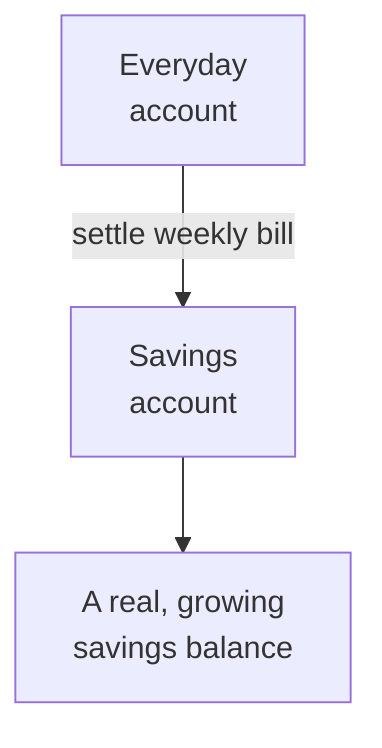
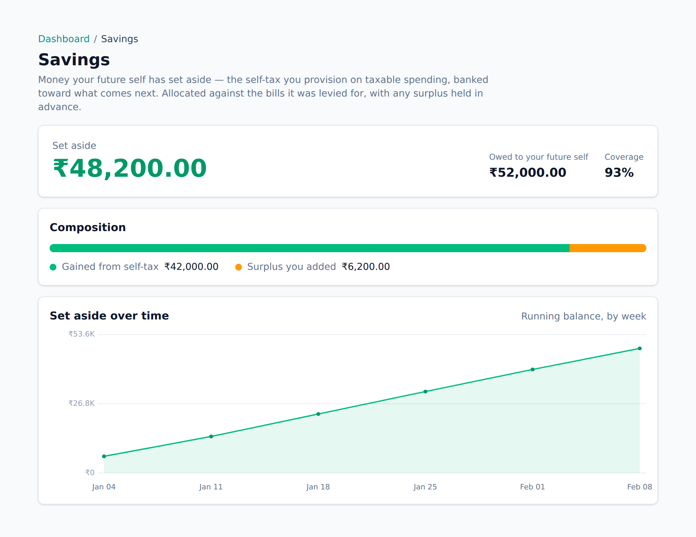

<!-- Tier: T0 · product · users. Assembled at aevum-finance by merging the backend + frontend
     lane T1 docs into one product narrative. The prose here is authored; the provenance block
     below is generated (tooling/build-public.mjs). Keep this page free of tier labels and
     internal paths — a reader must never be shown which module or bucket its content came from. -->

<!-- BEGIN GENERATED:provenance -->
<!-- Product topic "Your savings account". Reconciles these mirrored lane T1 docs
     (edit at source; reconcile the merge here):
     backend:  bank_accounts (the user's own account legs + the savings/committee account) -> ../internal/backend/public/bank_accounts.md
              treasury (the committee's append-only revenue books) -> ../internal/backend/public/treasury.md
     frontend:  bankAccounts (your accounts + the savings account, with UPI/QR input) -> ../internal/frontend/public/bank-accounts.md
              treasury (the Savings page) -> ../internal/frontend/public/treasury.md -->
<!-- END GENERATED:provenance -->

# Your savings account

The [consumption tax](consumption-tax.md) isn't just a number on a screen — it goes somewhere. That somewhere is your **savings account** (you may also see it called your _tax pot_): a real, growing balance, provisioned one purchase at a time.

## First, tell Aevum about your accounts

An account in Aevum is just a record of somewhere your money sits — an everyday bank account, a prepaid wallet like PhonePe or Paytm, or the account you set your tax aside into. You reach them under **Settings → Bank accounts**.

Adding accounts is optional — Aevum tracks and taxes your spending without a single one registered — but doing it unlocks two things: your [imported statements](transactions.md) land against the right account automatically, and your tax gets somewhere real to be saved.

For each account you give it a name and say what it's for: everyday spending, a savings goal, an emergency fund, a dependant's expenses. That "what it's for" is your call, not the bank's.

### Your UPI handles

Attach the **UPI IDs** you pay from to the account they belong to. This is what lets an imported statement land against the right account without you sorting it by hand — when Aevum sees a payment from a handle you've registered, it knows exactly which account it came from.

Because a single wrong character would quietly misfile your spending, Aevum tries hard to let you add an ID without typing it:

- **Scan its QR code** with your camera — handy on a laptop or tablet, where you hold your phone's UPI QR up to the screen.
- **Upload a screenshot** of the QR — handy on the phone itself, which can't photograph its own screen.
- **Paste it** — every UPI app has a "Copy UPI ID" button.
- Or type it, as a last resort.

However it arrives, the ID drops into the field for you to confirm before anything is saved — Aevum never commits a scanned code straight to your account, in case it misread. Case and spacing don't matter; the same handle typed two slightly different ways is recognised as one. And the same handle can belong to two people, so sharing a joint account never blocks you. You can attach more than one ID to an account.

## Nominating a savings account

Aevum's self-imposed tax moves money into a savings account you nominate. To be eligible, an account has to be marked as **savings** — everyday spending accounts can't be the pot, because that's money you'd spend, not money you've set aside. You can have more than one, and you choose which of them holds your tax. Until you've picked one, a gentle banner reminds you — because without it, your tax has nowhere to settle.

## Where the tax goes

When you settle a weekly bill, the money moves **out of your everyday account and into your savings account**. The discipline of the tax becomes a real, growing balance.

You settle bills two ways: **manually**, by recording a payment when you move the money, or **automatically**, by letting Aevum apply your savings transfers to your outstanding bills, oldest first. Either way the taxed amount ends up set aside. If bills pile up unpaid, Aevum steps in to protect you — it can pause auto-settlement and flag the backlog so nothing quietly spirals. (See [the consumption tax](consumption-tax.md) for how bills accrue and finalize.)

## Watching it grow

The **Savings** screen answers one simple question: how much have you set aside, and how solid is it? The headline balance sits beside two figures that give it meaning:

- **Owed to your future self** — the total tax levied across all your weeks. This is the target your savings work toward.
- **Coverage** — how much of that you've actually funded. Fully caught up, it reads full; behind, it tells you by how much. Until any tax has been levied it shows a dash rather than a misleading zero.

Below that, your balance splits by where it came from: **gained from self-tax** — money the mechanism set aside automatically as you spent — and **surplus you added**, anything you moved into savings on top, ahead of any bill. Early on it's all self-tax, so it reads as a single bar. And last is the **trend**: your running balance week by week, turning a series of small set-asides into a visible, climbing line.

You never wait for anything to "run" — every time you open Savings, Aevum re-reads what you've paid and what you owe yourself and reconciles the two on the spot. The record only ever gets _added to_, never quietly rewritten: if a payment is undone or a bill reopens, Aevum posts a correcting entry rather than editing the past, so what you saw last week is still what happened last week.

<picture>
  <source media="(prefers-color-scheme: dark)" srcset="images/screenshots/savings-dark.png">
  
</picture>

## Why we suggest two bank accounts

Aevum works best when your everyday spending and your savings live in two separate real-world accounts:

- Every expense draws down your everyday account by **more than the sticker price** — the purchase _plus_ its self-tax. That shrinking balance is the point: less disposable income sitting around is a quiet, constant nudge to save rather than spend.
- The money you set aside lands somewhere out of sight and out of temptation. Its first job is to build an **emergency buffer** before any of it becomes money you invest.

You _can_ run on a single account — mark bills paid when you actually move money aside — but physically segregating spending from savings is what makes the discipline real.

> **Changing what an account is for can re-sort your history.** Turn an account into your savings pot after you've imported transfers into it, and Aevum quietly re-reads them so your bills settle correctly. And you can't delete an account that has transactions — **archive** it instead, so your past records stay whole.

## What's coming next

Today the savings account is exactly that: real money, set aside, yours. It's also the **foundation for where Aevum is heading** — the plan is to grow it from a passive store into an active one, putting the balance you've built to work through investments and a portfolio. The same account you've been filling with everyday discipline becomes the engine for longer-term goals.

## FAQ

**Is the savings account a real bank account?**
It's a dedicated account _inside Aevum_ that tracks your set-aside savings. You move real money into it when you settle bills, so the balance reflects money you've genuinely provisioned.

**Do I have to pay every bill?**
To keep your savings building, yes — that's the point. Auto-settlement makes it effortless, and unpaid bills are flagged so nothing slips through.

**What's the "committee account" I saw mentioned?**
That's the name for this account's _future_ role — once investing and portfolio features arrive, it actively manages the balance rather than just holding it. Same account, bigger job.
