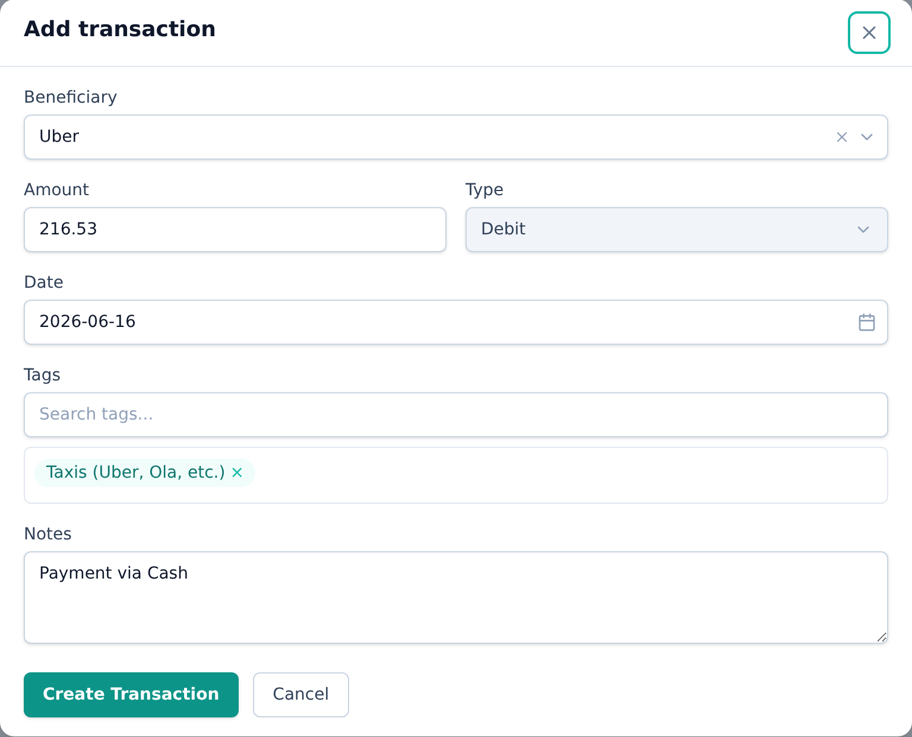
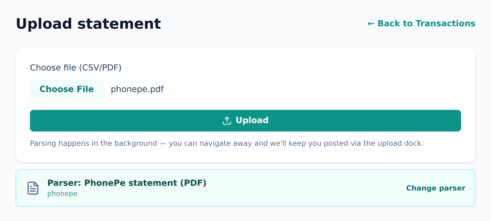
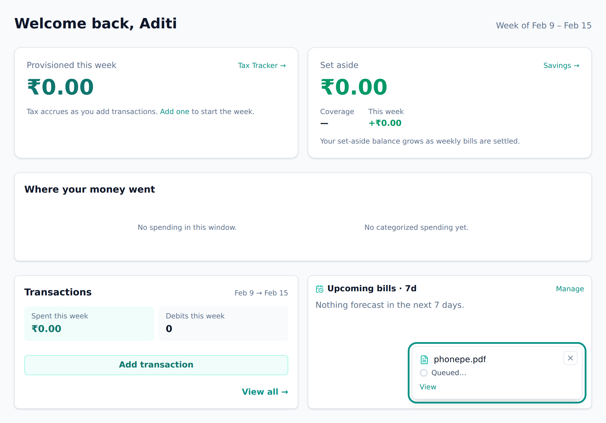
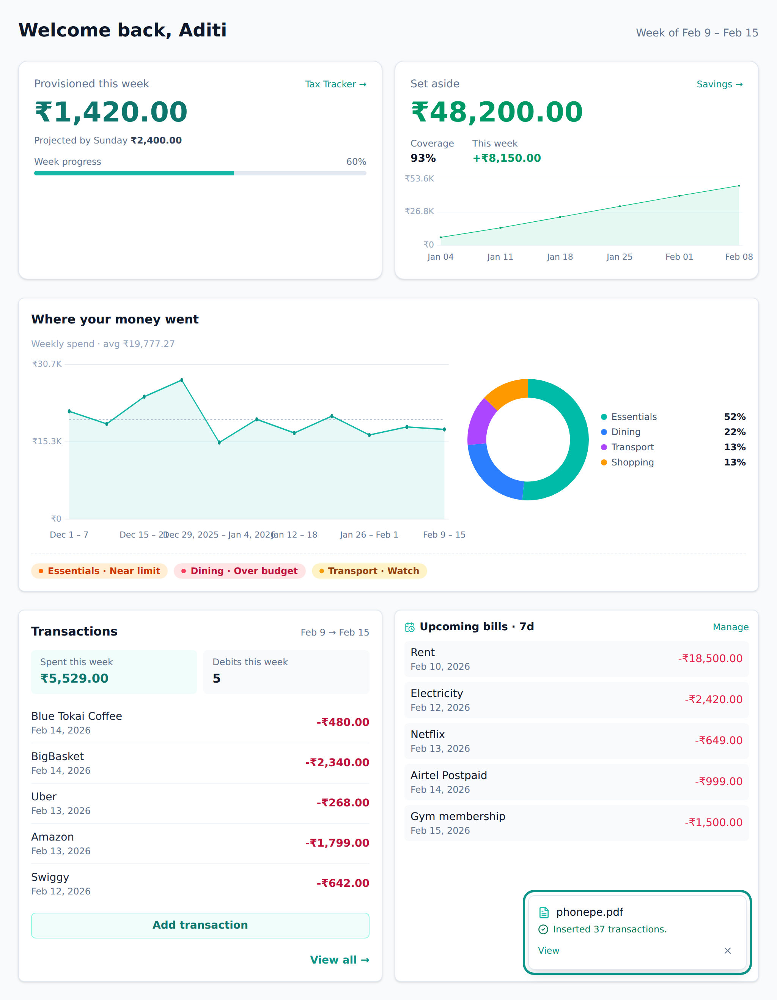
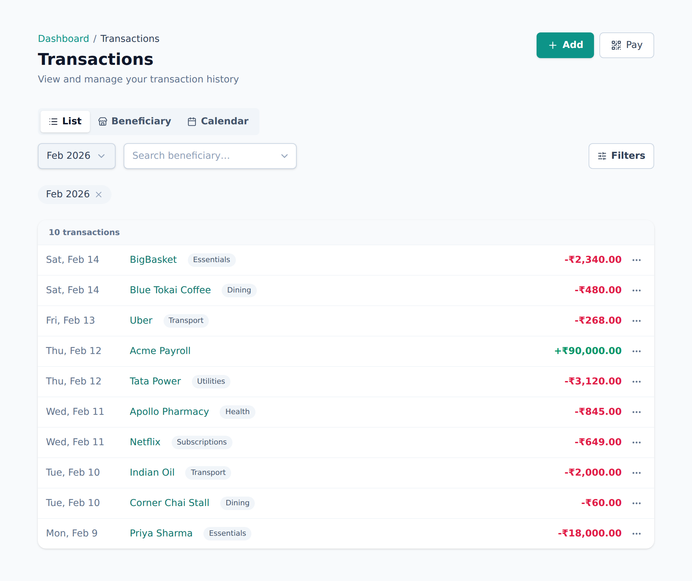
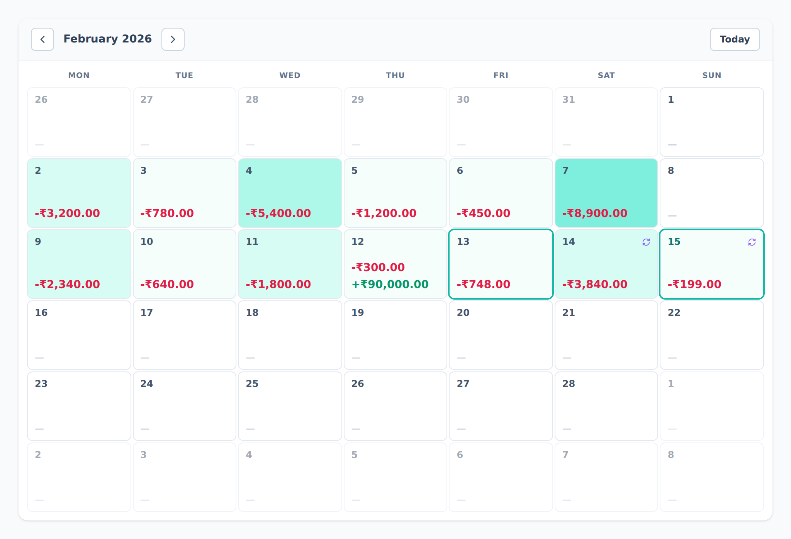

<!-- Tier: T0 · product · users. Assembled at aevum-hub by merging the backend + frontend
     lane T1 docs into one product narrative. The prose here is authored; the provenance block
     below is generated (tooling/build-public.mjs). Keep this page free of tier labels and
     internal paths — a reader must never be shown which module or bucket its content came from. -->

<!-- BEGIN GENERATED:provenance -->
<!-- Product topic "Transactions". Reconciles these mirrored lane T1 docs
     (edit at source; reconcile the merge here):
     backend:  transactions (the raw ledger + statement upload) -> ../internal/backend/public/transactions.md
     frontend:  transactions (the ledger, manual entry and statement upload) -> ../internal/frontend/public/transactions.md -->
<!-- END GENERATED:provenance -->

# Transactions

Everything in Aevum is built on transactions. A transaction is any money that moves — an expense you paid or income you received — recorded as a single line: how much, in or out, on what day, and who it was with. Your budgets, your weekly [consumption tax](consumption-tax.md), and your spending insights all read from this one record, so it's worth keeping honest. The good news: most of the keeping-honest happens for you.

There are two ways a transaction gets in, and both end up in the same ledger.

## Adding one by hand

Add an entry from the list at any time. You fill in:

- **Beneficiary** — who the money was with. That's either a merchant (a shop, service, or business) or a person. Start typing and pick an existing one, or add a new one on the spot. See [beneficiaries](beneficiaries.md).
- **Amount**, and whether it was money out (an expense) or money in (income).
- **Date**.
- **Categories** — usually filled in for you (below).
- An optional **note**, and which account it came from.

If you've set up a [rule](categories-and-rules.md) for that shop or person, picking them **auto-fills the categories**, so the entry lands ready to use. Accept them as they are, or adjust them just for this one transaction. If you change them, Aevum asks whether that's a one-off or a new rule to remember — so a quick tweak never quietly rewrites a rule you rely on.

Two things get double-checked as you add, because only you can settle them:

- If the entry looks like one you've **already recorded**, Aevum pauses and shows you both, so you don't quietly double-count.
- If it looks like the **other half of a transfer** between two of your own accounts, Aevum asks whether to join them into one move or keep them apart.

Anything you enter by hand you can freely edit or delete later.

<picture>
  <source media="(prefers-color-scheme: dark)" srcset="images/screenshots/add-transaction-dark.png">
  
</picture>

## Importing a bank or UPI statement

Instead of typing, upload a statement and let Aevum read every row out of it for you. It reads PDF statements from popular UPI apps — **PhonePe, Google Pay, Paytm** — and CSVs, with more formats added over time.

- **It happens in the background.** The moment you upload, Aevum takes you back to your dashboard and keeps reading — you'll watch the job move through _parsing → categorizing → done_, with a small progress indicator in the corner that follows you from page to page. Refreshing or moving around won't lose the import.
- **Aevum picks the right reader automatically** by looking at what's actually inside the file, not just its name. If it guesses wrong, pick the format yourself.
- **It knows which account it is.** If the statement names an account you've registered, the rows are linked to it; if not, Aevum offers to register it for you.
- **It won't import the same statement twice**, and if something goes wrong partway, nothing is left half-imported — just try again.

When it finishes, your transactions are in, already auto-categorized by your [rules](categories-and-rules.md), taxed, counted against [budgets](budgets.md), and feeding [recurring](recurring.md) detection like any others.

Because imported rows come straight from your bank, Aevum keeps their **amounts locked** — that's the official record. You can still re-categorize them or add a note; you just can't rewrite what the bank reported.

### The review list

Sometimes an import turns up entries Aevum genuinely can't judge on its own, so rather than guess, it holds them aside and asks:

- **Possible duplicates** — an entry that matches one you already have. Two identical coffees on the same day might be one payment recorded twice, or two real coffees; there's no telling from the numbers alone, so Aevum shows you both, side by side, and you decide.
- **Possible transfers** — money that looks like it moved between your own accounts. Confirm the account is yours once, and every future transfer between those two accounts is recognised automatically.

If an import overlaps heavily with what you already have, you can accept or skip the whole batch together. Either way, nothing is thrown away and nothing is added behind your back — these entries wait, out of your balance, until you answer.

<picture>
  <source media="(prefers-color-scheme: dark)" srcset="images/screenshots/import-statement-dark.png">
  
</picture>

<picture>
  <source media="(prefers-color-scheme: dark)" srcset="images/screenshots/parser-picker-dark.png">
  
</picture>

<picture>
  <source media="(prefers-color-scheme: dark)" srcset="images/screenshots/import-queue-dark.png">
  
</picture>

<picture>
  <source media="(prefers-color-scheme: dark)" srcset="images/screenshots/import-result-dark.png">
  
</picture>

## Three ways to look at the same money

A single toggle switches how your transactions are shown:

- **List** — the plain running list, newest first. Filter by type, category, month, or who you paid, and sort it however you like.
- **Beneficiary** — the same spending grouped by who received it, so you can see how much went to each shop or person over time.
- **Calendar** — a month (or a week, on a phone) with each day shaded by how much you spent, so heavy days stand out. Tap a day to see everything on it.

Whatever you filter to becomes part of the web address, so a filtered view is a link you can bookmark or share, and it survives a reload. You can look at a single week, a single month, or your whole history at once.

<picture>
  <source media="(prefers-color-scheme: dark)" srcset="images/screenshots/transactions-list-dark.png">
  
</picture>

<picture>
  <source media="(prefers-color-scheme: dark)" srcset="images/screenshots/transactions-calendar-dark.png">
  
</picture>

## Editing, deleting, and what ripples

Open any transaction to view or change it. Editing its amount or categories updates your tax and budgets immediately — including the current week's live bill. Edit a transaction from a week that's already closed and Aevum posts a small, clearly-labelled adjustment to your current week instead, so finalized bills are never rewritten (more in [consumption tax](consumption-tax.md)).

Deleting is a confirm-first action. If you delete a transaction that was settling some of your self-tax, Aevum asks whether to keep those bills settled or reopen them, so a cleanup never quietly changes what you owe. And nothing is ever truly erased: a deleted record is hidden from every list and total but kept quietly underneath, so anything that depended on it still adds up. The same care applies to names — delete a payee and past transactions keep showing the name as it was at the time, rather than going blank.

When a payment settles one of your recurring bills, it's marked and linked straight back to the [recurring](recurring.md) schedule it belongs to, so a single payment is always traceable to where it came from.

## FAQ

**What's a "beneficiary"?**
Just the other side of the transaction — the merchant you paid or the person you sent money to. Grouping by beneficiary is how Aevum learns your patterns and auto-categorizes future spending.

**Do I record income too?**
Yes. Income isn't taxed, but recording it gives you the full picture and helps with budgets and recurring detection.

**My statement type isn't listed.**
Aevum supports the common UPI apps today and adds more over time. If automatic detection fails, choose the closest matching format by hand.

**Why did my weekly bill change when I edited a transaction?**
Because the tax is calculated live. Editing a transaction in the current week recalculates it immediately; editing one from a finalized week posts a small adjustment to the current week instead.
